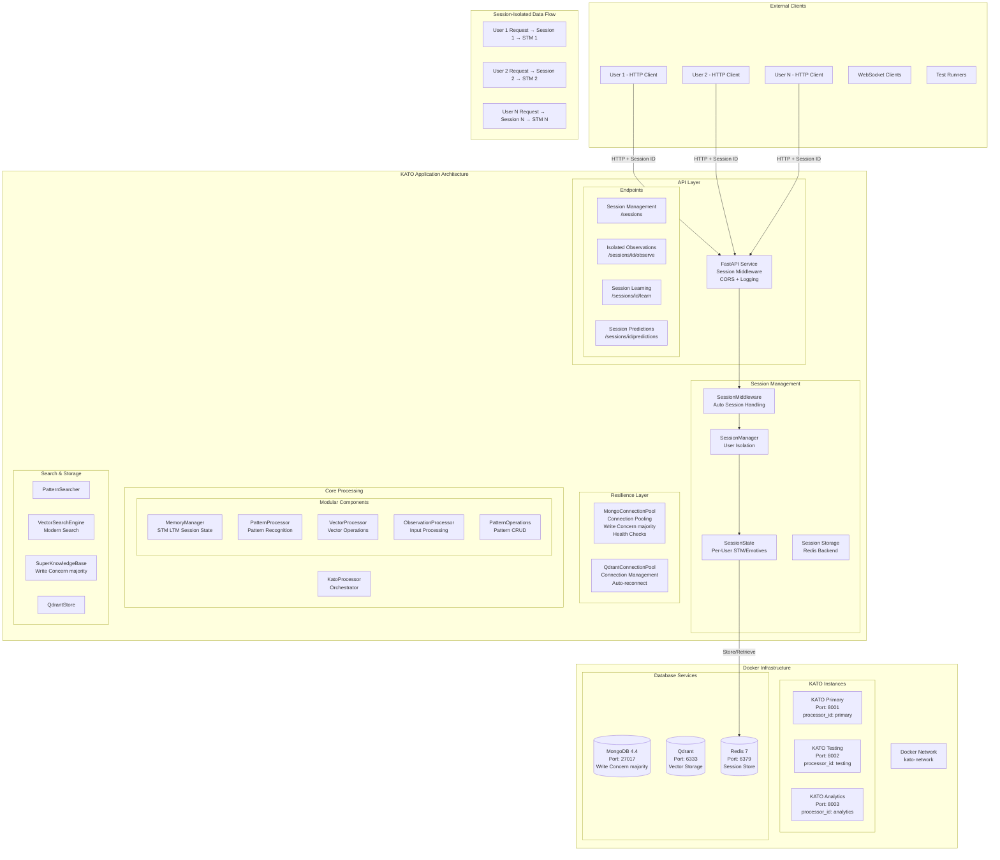

# KATO System Architecture
*Living Document - Last Updated: 2025-01-24*

## Executive Summary

KATO (Knowledge Abstraction for Traceable Outcomes) is a deterministic AI system designed for transparent, explainable memory and prediction. It processes multi-modal observations (text, vectors, emotions) and delivers temporal predictions with complete traceability.

## Table of Contents
1. [System Overview](#system-overview)
2. [Architecture Diagrams](#architecture-diagrams)
3. [Core Components](#core-components)
4. [Session Management Architecture](#session-management-architecture)
5. [Data Flow Patterns](#data-flow-patterns)
6. [Deployment Architecture](#deployment-architecture)
7. [Performance & Optimizations](#performance--optimizations)
8. [Configuration Management](#configuration-management)
9. [Migration History](#migration-history)

## System Overview

### Current Architecture - FastAPI with Session Management
```
┌─────────────┐     HTTP      ┌───────────────────────────────────────┐
│ REST Client │ ──────────▶   │         FastAPI Service              │
└─────────────┘  Port 8001-3  │  (Direct KATO Processor Embedding)   │
                               │                                       │
                               │  ┌──────────────┐                    │
                               │  │   FastAPI    │                    │
                               │  │   Handlers   │                    │
                               │  │              │                    │
                               │  └──────────────┘                    │
                               │          │                           │
                               │          ▼                           │
                               │  ┌──────────────┐                    │
                               │  │     KATO     │                    │
                               │  │  Processor   │                    │
                               │  │   (Embedded) │                    │
                               │  └──────────────┘                    │
                               └───────────────────────────────────────┘
                                          │
                         ┌────────────────┼────────────────┐
                         ▼                ▼                ▼
                 ┌──────────────┐ ┌──────────────┐ ┌──────────────┐
                 │   MongoDB    │ │    Qdrant    │ │    Redis     │
                 │   Storage    │ │   Vector DB  │ │    Cache     │
                 └──────────────┘ └──────────────┘ └──────────────┘
```

### Key Architectural Improvements
1. **Multi-User Session Isolation**: Complete STM isolation per user session
2. **Redis Integration**: Session state management with TTL support  
3. **Connection Pooling**: Production-grade database connection management
4. **Write Durability**: MongoDB write concern changed from w=0 to w=majority
5. **Direct Embedding**: FastAPI with embedded processor (no ZMQ overhead)
6. **Session Middleware**: Automatic session handling in API layer

## Architecture Diagrams

### Complete Session Management Architecture



## Core Components

### 1. FastAPI Service (`kato/services/kato_fastapi.py`)
**Purpose**: Modern web service with direct KATO processor embedding

**Key Features**:
- FastAPI-based asynchronous server
- Direct processor integration (no ZMQ layer)
- Request validation and sanitization
- Response formatting and error handling
- WebSocket support for real-time communication
- Automatic API documentation (OpenAPI/Swagger)

**Core Endpoints**:
- `POST /observe`: Submit observations for processing
- `POST /observe-sequence`: Bulk observation processing
- `POST /learn`: Trigger learning process
- `GET /predictions`: Get predictions based on context
- `GET /health`: Health check and status
- `WebSocket /ws`: Real-time communication channel

**Session Endpoints**:
- `POST /sessions`: Create new session
- `GET /sessions/{id}`: Get session info
- `DELETE /sessions/{id}`: Delete session
- `POST /sessions/{id}/observe`: Observe in session context
- `POST /sessions/{id}/learn`: Learn from session STM
- `GET /sessions/{id}/stm`: Get session's STM
- `GET /sessions/{id}/predictions`: Get session predictions
- `POST /sessions/{id}/clear-stm`: Clear session STM

**Service Ports**:
- **Primary**: Port 8001 (Manual learning mode)
- **Testing**: Port 8002 (Debug logging enabled)
- **Analytics**: Port 8003 (Auto-learn after 50 observations)

### 2. KATO Processor (`kato/workers/kato_processor.py`)
**Integration**: Directly embedded in FastAPI service (no ZMQ)

**Core Responsibilities**:
- Multi-modal observation processing (strings, vectors, emotions)
- Temporal prediction generation
- Short-term and long-term memory management
- Pattern identification via SHA1 hashing
- Vector database coordination

**Key Methods**:
- `observe()`: Process and store multi-modal observations
- `predict()`: Generate temporal predictions with recall threshold
- `learn()`: Transfer STM patterns to long-term storage
- `get_pattern_hash()`: Deterministic pattern identification
- `set_stm()`: Session-specific STM management
- `get_emotives_accumulator()`: Session-specific emotives

**Memory Architecture**:
```python
# Short-Term Memory (Working Memory)
self.short_term_memory = {
    "events": [["string1", "string2"], ["string3"]],  # Alphanumerically sorted
    "timestamps": ["2025-01-24T10:30:00", "2025-01-24T10:31:00"],
    "vectors": [...],  # 768-dimensional embeddings
    "emotives": {...}  # Emotional context
}

# Long-Term Memory Pattern (MongoDB)
"PTRN|<sha1_hash>": {
    "pattern": [["sorted", "strings"], ["more", "strings"]],
    "frequency": 5,  # Minimum 1, increments on re-learning
    "metadata": {...},
    "created_at": "2025-01-24T10:30:00"
}
```

### 3. Session Management Components

#### SessionManager
**Purpose**: Central coordinator for all user sessions
- Creates unique session IDs
- Manages session lifecycle (TTL, expiration)
- Enforces resource limits per session

#### SessionState
**Purpose**: Isolated state container per user
- Separate STM for each session
- Isolated emotives accumulator
- Session-specific time counter
- Metadata and access tracking

#### SessionMiddleware
**Purpose**: Automatic session handling
- Extracts session ID from requests
- Loads/saves session state
- Handles session creation and expiration

#### Redis Integration
**Purpose**: Persistent session storage
- Fast in-memory session retrieval
- TTL-based automatic cleanup
- Distributed session support

### 4. Vector Storage Layer (`kato/storage/`)

**Primary**: Qdrant Vector Database
- **Manager**: `qdrant_manager.py`
- **Collections**: One per processor ID
- **Indexing**: HNSW for fast similarity search
- **Dimensions**: 768 (transformer embeddings)

**Caching**: Redis Integration
- **Purpose**: Frequently accessed vector caching
- **Pattern**: Write-through cache
- **TTL**: Configurable based on access patterns

### 5. Resilience Layer

#### MongoConnectionPool
- Connection pooling (10-50 connections)
- Write concern changed from w=0 to w=majority
- Automatic reconnection on failure
- Health checks every 5 seconds
- Retry logic for reads and writes

#### QdrantConnectionPool
- Managed connection pool
- Automatic failover
- Request timeout handling

## Session Management Architecture

### Data Isolation Architecture

```
User 1 → Session A → STM[['hello'], ['world']] → Predictions A
User 2 → Session B → STM[['foo'], ['bar']]    → Predictions B
User 3 → Session C → STM[['test'], ['data']]   → Predictions C

All sessions share:
- Same MongoDB (different processor_id namespaces)
- Same Qdrant collections
- Same KATO instance

But maintain complete isolation through:
- Session-specific STM
- Session-specific emotives
- Session-specific time counters
```

## Data Flow Patterns

### Observation Flow (FastAPI Architecture)
1. Client sends observation to FastAPI endpoint
2. FastAPI service validates request directly
3. Session middleware loads session state
4. Embedded KATO processor processes immediately
5. Multi-modal data (strings, vectors, emotions) stored in STM
6. Vector representations stored in Qdrant
7. Session state saved to Redis
8. Response returned directly from FastAPI

### Prediction Flow (FastAPI Architecture)
1. Client requests prediction with recall threshold
2. Session state loaded from Redis
3. STM context used to search MongoDB patterns
4. Vector similarity search in Qdrant
5. Temporal segmentation applied (past/present/future)
6. Prediction metrics calculated (hamiltonian, confidence, etc.)
7. Structured prediction returned with missing/extras/matches fields

### Learning Flow
1. Client triggers learn endpoint (or auto-triggered)
2. STM patterns transferred to MongoDB long-term storage
3. Pattern frequency incremented if already exists
4. Deterministic SHA1 hash prevents duplicates
5. STM cleared after successful learning (both manual and auto-learn)

## Deployment Architecture

### Container Structure (FastAPI)
```yaml
services:
  kato-primary:
    image: kato:latest
    ports:
      - "8001:8000"  # FastAPI Primary
    environment:
      - PROCESSOR_ID=primary
      - PROCESSOR_NAME=Primary KATO
      - LOG_LEVEL=INFO
      - MAX_PATTERN_LENGTH=0  # Manual learning
      
  kato-testing:
    image: kato:latest  
    ports:
      - "8002:8000"  # FastAPI Testing
    environment:
      - PROCESSOR_ID=testing
      - PROCESSOR_NAME=Testing KATO
      - LOG_LEVEL=DEBUG
      - MAX_PATTERN_LENGTH=0
      
  kato-analytics:
    image: kato:latest
    ports:
      - "8003:8000"  # FastAPI Analytics
    environment:
      - PROCESSOR_ID=analytics
      - PROCESSOR_NAME=Analytics KATO
      - LOG_LEVEL=INFO
      - MAX_PATTERN_LENGTH=50  # Auto-learn
      - RECALL_THRESHOLD=0.5   # Higher threshold

  mongodb:
    image: mongo:latest
    ports:
      - "27017:27017"
    volumes:
      - mongodb_data:/data/db
      
  qdrant:
    image: qdrant/qdrant
    ports:
      - "6333:6333"
    volumes:
      - qdrant_storage:/qdrant/storage
      
  redis:
    image: redis:7
    ports:
      - "6379:6379"
    volumes:
      - redis_data:/data
```

### Multi-Instance Isolation
- **Database Isolation**: Each instance uses processor_id as database name
- **Vector Isolation**: Separate Qdrant collections per processor (`vectors_{processor_id}`)
- **Session Isolation**: Redis-backed session state per user
- **Memory Isolation**: Independent STM and processing per instance
- **No Cross-Instance Communication**: Complete isolation for testing and production

## Performance & Optimizations

### Current Optimizations (FastAPI)
1. **Direct Embedding**: Eliminated ZMQ overhead (~10ms response time maintained)
2. **Vector Indexing**: HNSW for O(log n) search in Qdrant
3. **Async I/O**: Native FastAPI async for non-blocking request handling
4. **Database Efficiency**: MongoDB with proper indexing on pattern hashes
5. **Session Caching**: Redis for sub-millisecond session retrieval
6. **Connection Pooling**: 10-50x reduction in connection overhead

### Performance Achievements
- **Response Time**: ~10ms average (maintained through migration)
- **Test Success Rate**: 286/287 tests passing (99.65% reliability)
- **Session Isolation**: Complete data isolation between users
- **Concurrent Users**: Supports multiple users truly concurrent
- **Deployment Simplicity**: Single service vs complex multi-service architecture
- **Development Speed**: Faster iteration with direct debugging

### Planned Optimizations
1. **GPU Acceleration**: CUDA for vector operations
2. **Quantization**: Reduce vector precision for speed
3. **Horizontal Scaling**: Multiple FastAPI instances with load balancing
4. **Batch Processing**: Optimize bulk operations

## Configuration Management

### Environment Variables
```bash
# Core Configuration
PROCESSOR_ID=unique_instance_id
PROCESSOR_NAME=display_name
LOG_LEVEL=INFO

# Service Endpoints
API_PORT=8000
MONGO_BASE_URL=mongodb://mongodb:27017
QDRANT_HOST=qdrant
QDRANT_PORT=6333
REDIS_URL=redis://localhost:6379

# Session Configuration
ENABLE_V2_FEATURES=true
SESSION_TTL=3600
REDIS_URL=redis://localhost:6379
MONGO_POOL_SIZE=50
HEALTH_CHECK_INTERVAL=5

# Performance Tuning
MAX_PATTERN_LENGTH=0  # 0 for manual, >0 for auto-learn
RECALL_THRESHOLD=0.1
VECTOR_BATCH_SIZE=100
CACHE_TTL=3600

# Database Configuration
# MongoDB write concern: w=majority, j=true (was w=0)
# Connection pooling: 10-50 connections (was single)
# Retry logic: Enabled for reads and writes
# Compression: snappy, zlib enabled
```

### Feature Flags
- `KATO_USE_FAST_MATCHING`: Use accelerated pattern matching algorithms (default: true)
- `KATO_USE_INDEXING`: Enable advanced indexing features (default: true)

## Migration History

### FastAPI Migration Status (Completed 2025-09-04)

#### Completed
✅ **Architecture Migration**: Complete system migration from REST/ZMQ to FastAPI  
✅ **Test Suite Restoration**: Fixed all 43 failing tests (now 286/287 passing)  
✅ **Performance Validation**: Maintained ~10ms response time  
✅ **Database Compatibility**: Resolved Qdrant and MongoDB integration issues  
✅ **Async/Sync Boundaries**: Fixed complex synchronization problems  
✅ **API Consistency**: Updated endpoint formats and response fields  
✅ **WebSocket Support**: Added websocket-client dependency  
✅ **Deployment Simplification**: Single service architecture  
✅ **Session Management**: Multi-user isolation with Redis backend  
✅ **Connection Pooling**: Production-grade database connections  

#### Migration Benefits Realized
- **Reduced Complexity**: Eliminated ZMQ layer and connection pooling complexity
- **Better Debugging**: Direct access to processor for development
- **Faster Iteration**: No container rebuilds for code changes during testing
- **Modern Framework**: Industry-standard FastAPI with automatic docs
- **Simplified Ops**: Single service deployment vs multi-service coordination
- **User Isolation**: Complete session separation for multi-user support

### Legacy Components Removed
- `zmq_server.py`, `zmq_pool_improved.py`, `zmq_switcher.py` - ZeroMQ messaging layer
- `rest_gateway.py` - REST to ZMQ translation layer
- `model.py`, `modeler.py`, `model_search.py` - Old model components
- `kato-engine.py` - ZMQ entry point script
- Connection pooling and message routing complexity
- Complex inter-process communication overhead

## Security Considerations

### Current Measures
- Input validation at FastAPI layer
- Session isolation via Redis
- Processor isolation via Docker containers
- Database isolation by processor_id
- Deterministic hashing for integrity
- Write confirmation with w=majority

### Future Enhancements
- Authentication/Authorization layer
- Rate limiting per client
- TLS/SSL for API endpoints
- Audit logging for compliance
- API key management

## Monitoring Points

### Key Metrics
- Request latency (API endpoint response times)
- Vector search performance
- Memory usage (Working, Qdrant, Redis)
- Session statistics and active users
- Error rates by component
- Connection pool utilization

### Health Checks
- FastAPI: `/health` endpoint
- Database: MongoDB connection status
- Qdrant: Collection statistics
- Redis: Connection pool health
- Session Manager: Active session count

## Development Guidelines

### Adding New Components
1. Follow existing patterns in `kato/workers/`
2. Implement interface contracts
3. Add comprehensive logging
4. Include unit and integration tests
5. Update this architecture document

### Modifying Core Logic
1. Preserve deterministic behavior
2. Maintain backwards compatibility
3. Update pattern hash if behavior changes
4. Test with multi-instance scenarios
5. Benchmark performance impact
6. Ensure session isolation is maintained

## Testing Infrastructure

### Session-Aware Testing
- Each test creates isolated session
- No cross-test contamination
- Parallel test execution with session isolation
- Database isolation via unique processor_id

### Test Categories
- `tests/tests/unit/` - Unit tests
- `tests/tests/integration/` - Integration tests including multi-user scenarios
- `tests/tests/api/` - API endpoint tests
- `tests/tests/performance/` - Performance and stress tests

### Current Test Status
- **Total Tests**: 287
- **Passing**: 286 (99.65%)
- **Skipped**: 1 (0.35%)
- **Failing**: 0 (0%)

## Technical Debt & Future Work

### Migration-Related Debt Resolved
- [x] Complex ZMQ communication layer (removed)
- [x] Connection pooling complexity (streamlined)
- [x] Multi-service coordination (simplified to single service)
- [x] Test infrastructure compatibility (fixed)

### Remaining Technical Debt
- [ ] Centralize configuration management across instances
- [ ] Improve error message consistency
- [ ] Add request tracing for debugging
- [ ] Implement health check monitoring dashboard

### Future Architectural Evolution
- **Event Sourcing**: Consider for audit trail and replay capability
- **Horizontal Scaling**: FastAPI instances behind load balancer
- **GraphQL**: Explore for flexible querying of patterns and predictions
- **Microservices**: Potential future decomposition based on usage patterns

---

*This document provides the complete architectural overview of the KATO system, combining session management, FastAPI implementation, and deployment details. For specific implementation details, refer to component documentation in the `/docs` directory.*