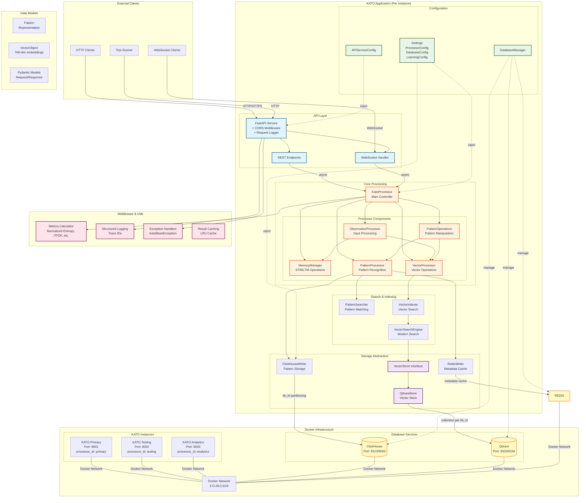

# KATO System Architecture

## Overview
KATO (Knowledge Abstraction for Traceable Outcomes) is a deterministic memory and prediction system for transparent, explainable AI. This document provides a comprehensive architectural diagram showing all components and their communication patterns.

## Architecture Diagram

## Component Descriptions

### 1. API Layer (FastAPI)
The API layer provides the external interface for KATO:

- **FastAPI Service**: Modern async Python web framework with automatic OpenAPI documentation
- **REST Endpoints**: 
  - `/observe` - Process observations
  - `/learn` - Learn patterns from STM
  - `/predictions` - Get predictions
  - `/stm` - View short-term memory
  - `/clear-stm` - Clear short-term memory
  - `/pattern/{id}` - Get specific pattern
  - `/sessions/{session_id}/config` - Update session configuration
  - `/metrics` - System metrics
- **WebSocket Handler**: Real-time bidirectional communication at `/ws`
- **Middleware**:
  - CORS for cross-origin requests
  - Request logging with trace IDs
  - Performance timing

### 2. Core Processing Layer
The heart of KATO's AI processing:

- **KatoProcessor**: Main controller that orchestrates all operations
  - Manages processor lifecycle
  - Coordinates between components
  - Maintains processor state
  
- **MemoryManager**: Handles memory operations
  - Short-Term Memory (STM) management
  - Long-Term Memory (LTM) operations
  - Emotives accumulation
  - State variable management
  
- **PatternProcessor**: Core pattern recognition
  - Pattern learning from STM
  - Pattern matching and prediction
  - Temporal and non-temporal patterns
  - Frequency and emotives tracking
  
- **VectorProcessor**: Vector embedding operations
  - 768-dimensional vector processing
  - Vector similarity search
  - Vector-to-symbol conversion
  
- **ObservationProcessor**: Input processing
  - String symbol processing
  - Vector data handling
  - Emotives processing
  - Auto-learning triggers
  
- **PatternOperations**: Pattern utilities
  - Pattern manipulation
  - Pattern comparison
  - Pattern merging

### 3. Search & Indexing Layer
High-performance search capabilities:

- **PatternSearcher**: Pattern matching engine
  - Recall threshold filtering
  - Partial pattern matching
  - Frequency-based ranking
  
- **VectorIndexer**: Legacy vector search
  - Parallel search workers
  - Round-robin distribution
  
- **VectorSearchEngine**: Modern vector search
  - Qdrant integration
  - HNSW indexing
  - Result caching
  - Batch processing

### 4. Storage Layer
Database abstraction and management:

- **ClickHouseWriter**: ClickHouse pattern storage
  - Pattern data with SHA1 hashing
  - Multi-stage filter pipeline (MinHash/LSH/Bloom)
  - Partitioning by kb_id for isolation
  - Billion-scale performance

- **RedisWriter**: Redis metadata caching
  - Pattern frequency counters
  - Emotive profiles (rolling window)
  - Fast metadata access
  - Session state management

- **QdrantStore**: Vector database implementation
  - HNSW index configuration
  - Quantization support
  - GPU acceleration ready
  - Collection management

- **VectorStore Interface**: Storage abstraction
  - Backend agnostic interface
  - Async operations
  - Batch processing

### 5. Database Services

#### ClickHouse
- **Purpose**: Pattern data storage with high-performance filtering
- **Table Structure**:
  - `patterns` - Learned patterns partitioned by kb_id
  - Columns: name, kb_id, length, events, emotive_profile, metadata, observation_count
- **Indexing**: Primary key on (kb_id, name) with Bloom filter
- **Partitioning**: By kb_id for node isolation
- **Performance**: Billion-scale with multi-stage filter pipeline

#### Redis
- **Purpose**: Pattern metadata caching and session state
- **Data Structures**:
  - Pattern frequency counters (per kb_id)
  - Emotive profiles (rolling windows)
  - Session state (TTL-based)
- **Key Namespacing**: By session_id and kb_id for isolation

#### Qdrant
- **Purpose**: High-performance vector similarity search
- **Features**:
  - HNSW indexing for fast search
  - Collection per kb_id
  - Cosine similarity metric
  - Optional quantization

### 6. Configuration System
Comprehensive configuration management:

- **Settings**: Central configuration using Pydantic
  - ProcessorConfig - Instance identification
  - LearningConfig - Learning parameters
  - DatabaseConfig - Database connections
  - ProcessingConfig - Processing behavior
  
- **APIServiceConfig**: API-specific settings
  - Uvicorn configuration
  - Port and host settings
  - Worker configuration
  
- **DatabaseManager**: Connection management
  - Connection pooling
  - Health checks
  - Failover support

### 7. Middleware & Utilities

- **Metrics Calculator**:
  - Normalized entropy calculations
  - ITFDF similarity metrics
  - Confidence and evidence scoring
  - Confluence probability
  
- **Structured Logging**:
  - JSON or human-readable formats
  - Trace ID propagation
  - Performance timing
  - Request/response logging
  
- **Exception Handling**:
  - Hierarchical exception classes
  - Structured error responses
  - Trace ID in errors
  
- **Result Caching**:
  - LRU cache for predictions
  - Vector search result caching
  - Configurable cache sizes

### 8. Test Infrastructure

- **Fixture-based Testing**:
  - Automatic processor_id isolation
  - Per-test database isolation
  - Parallel test execution
  
- **Local Python Execution**:
  - Tests run locally, connect to Docker
  - Fast debugging with print/breakpoints
  - No container rebuilds for tests

## Communication Patterns

### Synchronous Communication
1. **HTTP REST**: Client → FastAPI → KatoProcessor → Response
2. **Database Queries**: Processors → ClickHouse/Qdrant/Redis → Results

### Asynchronous Communication
1. **WebSocket**: Bidirectional real-time updates
2. **Async Processing**: FastAPI async handlers with processor locks

### Isolation Mechanisms
1. **Processor ID Isolation**: Each instance has unique processor_id
2. **Database Isolation**: Separate collections/databases per processor
3. **Lock-based Synchronization**: Processing lock ensures sequential operations

## Deployment Architecture

### Docker Composition
- **ClickHouse**: Shared database service (partitioned by kb_id)
- **Redis**: Shared cache and session service
- **Qdrant**: Shared vector database
- **KATO Instances**: Multiple isolated processors
- **Docker Network**: Bridge network for inter-service communication

### Scaling Strategy
1. **Horizontal Scaling**: Add more KATO instances with unique kb_id values
2. **Database Scaling**: ClickHouse distributed tables, Qdrant clustering, Redis cluster
3. **Load Balancing**: Optional Nginx for distribution

## Security Considerations

1. **Database Security**:
   - ClickHouse authentication and access control
   - Redis authentication (optional)
   - Network isolation

2. **API Security**:
   - CORS configuration
   - Optional API keys
   - Rate limiting ready

3. **Data Isolation**:
   - Complete kb_id isolation via partitioning
   - No cross-contamination between nodes
   - Audit trail via trace IDs

## Performance Optimizations

1. **Multi-Stage Filter Pipeline**:
   - MinHash for billion-scale similarity at O(1)
   - LSH bucketing for candidate reduction
   - Bloom filters for fast existence checks
   - ClickHouse partitioning for kb_id isolation

2. **Vector Search**:
   - HNSW indexing for O(log n) search
   - Result caching in Redis
   - Batch processing

3. **Pattern Matching**:
   - ClickHouse partitioned queries
   - Parallel search workers
   - Frequency-based pruning from Redis

4. **Memory Management**:
   - Deque for efficient STM
   - Redis metadata caching
   - Connection pooling

## Monitoring & Observability

1. **Metrics Endpoint**: `/metrics` for system stats
2. **Health Checks**: `/health` for liveness
3. **Structured Logging**: JSON logs with trace IDs
4. **Performance Timing**: Request duration tracking

This architecture provides a robust, scalable, and transparent AI system with complete explainability and traceability of all operations.