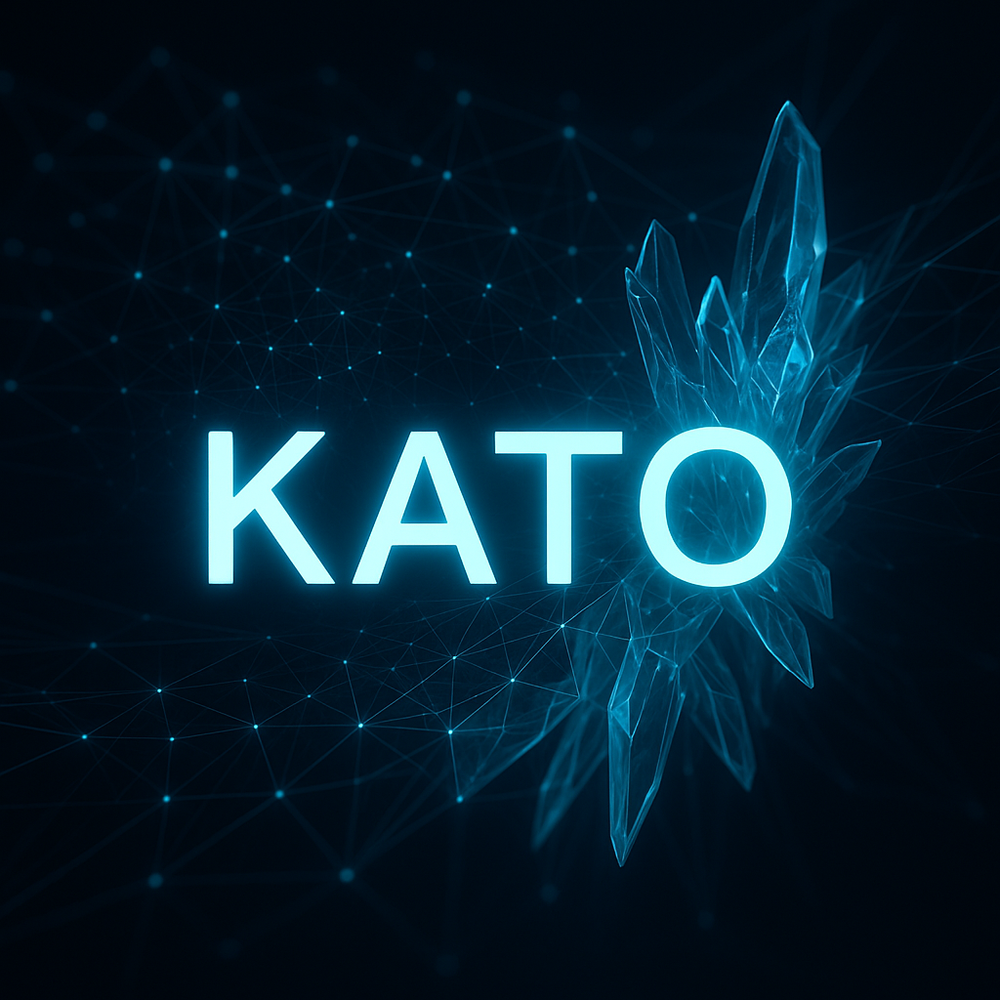
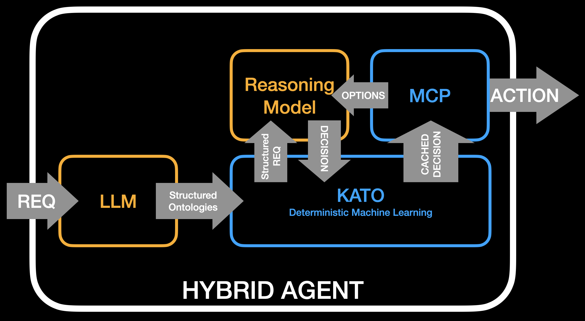

# KATO

**Knowledge Abstraction for Traceable Outcomes**

> *Transparent memory and abstraction for agentic AI systems — deterministic, explainable, and emotive-aware.*

🆕 **Latest Features**: Multi-user session isolation, guaranteed writes, Redis sessions, complete backwards compatibility



## What is KATO?

KATO is a specialized AI module that provides **deterministic memory, abstraction, and recall** for modern agentic AI systems. It learns patterns from observations and makes temporal predictions with complete transparency and traceability.

### Pattern-Based Learning

KATO uses **patterns** as its core learning concept:
- **Temporal Patterns**: Time-ordered patterns with temporal dependencies
- **Profile Patterns**: Collections without temporal ordering requirements

Every learned structure in KATO is identified by a unique hash: `PTRN|<sha1_hash>`

**Important**: Patterns require at least 2 strings total to generate predictions. When learning patterns, frequency starts at 1 and increments with each re-learning of the same pattern.

### Key Features

✨ **Deterministic Learning** - Same inputs always yield same outputs  
🔍 **Full Transparency** - All internal states and decisions are explainable  
🎯 **Temporal Predictions** - Sophisticated past/present/future segmentation  
🧠 **Multi-Modal Support** - Process text, vectors, and emotional context  
⚡ **High Performance** - FastAPI async architecture with embedded processors  
🔄 **Stateful Processing** - Maintains context across observations  
🚀 **Multi-Instance Support** - Run multiple processors with different configurations  
📊 **Instance Isolation** - Each processor_id has completely isolated databases  
🎪 **Vector Database** - Modern vector search with Qdrant (10-100x faster)  
👥 **Multi-User Sessions** - Complete STM isolation per user session  
💾 **Write Guarantees** - MongoDB majority write concern prevents data loss  
🔐 **Session Management** - Redis-backed sessions with TTL and isolation  

### Example Architecture



Combining KATO with black box stochastic processes such as Generative Pre-trained Transformer (GPT) models, Large Language Models (LLMs), Small Language Models (SLMs), and GPT-based reasoning models provides a layer of governance and control. These stochastic machine learning models suffer from issues like hallucinations, inconsistent outputs, hidden biases, high training and operational costs, and no assurances for guardrails or remediation attempts.

KATO provides a deterministic machine learning algorithm that learns context + action + outcome patterns, effectively caching for reduced calls to expensive models. Additionally, it stores these patterns in a traceable database (typically MongoDB) allowing both real-time learning and updates. If an action taken by the agent needs to be corrected so that it isn't repeated given the same or similar context, the database can simply be edited with an alternative action.


## Prerequisites

### System Requirements
- Docker and Docker Compose
- Python 3.9+ (for local development)
- 4GB+ RAM recommended
- MongoDB (auto-started with Docker)
- Qdrant Vector Database (auto-started with Docker)
- Redis (auto-started with Docker)

### Required Python Packages (for development)
```bash
pip install -r requirements.txt
pip install -r tests/requirements.txt
```

## Quick Start

### 1. Clone and Build
```bash
# Clone repository
git clone https://github.com/your-org/kato.git
cd kato

# Build Docker image
./kato-manager.sh build
```

### 2. Start Services
```bash
# Start all services (includes MongoDB, Qdrant, Redis)
./kato-manager.sh start

# Services will be available at:
# - Primary KATO: http://localhost:8001
# - Testing KATO: http://localhost:8002
# - Analytics KATO: http://localhost:8003
# - MongoDB: mongodb://localhost:27017
# - Qdrant: http://localhost:6333
# - Redis: redis://localhost:6379
```

### 3. Verify Installation
```bash
# Check health
curl http://localhost:8001/health

# Response:
# {"status": "healthy", "processor_id": "primary", "uptime": 123.45}

# Quick test of session features
python test_v2_quick.py

# Check API documentation
# Open in browser: http://localhost:8001/docs
```

### 4. Basic Usage

#### Option A: Using Sessions (Recommended)
```bash
# Create a session for user isolation
SESSION=$(curl -s -X POST http://localhost:8001/sessions \
  -H "Content-Type: application/json" \
  -d '{"user_id": "alice"}' | jq -r '.session_id')

# Observe in isolated session
curl -X POST http://localhost:8001/sessions/$SESSION/observe \
  -H "Content-Type: application/json" \
  -d '{"strings": ["hello", "world"]}'

# Get session's isolated STM
curl http://localhost:8001/sessions/$SESSION/stm
```

#### Option B: Default Session API (backwards compatible)
```bash
# Send observation (backward compatible)
curl -X POST http://localhost:8001/observe \
  -H "Content-Type: application/json" \
  -d '{
    "strings": ["hello", "world"],
    "vectors": [],
    "emotives": {"joy": 0.8},
    "unique_id": "obs-123"  # Optional unique identifier
  }'

# Learn pattern from current STM
curl -X POST http://localhost:8001/learn
# Returns: {"pattern_name": "PTRN|<hash>", "processor_id": "...", "message": "..."}

# Get predictions
curl -X GET http://localhost:8001/predictions
# Or with specific observation ID:
curl -X GET "http://localhost:8001/predictions?unique_id=obs-123"
```

## Core Concepts

KATO processes observations as **events** containing strings, vectors, and emotives. Each event is processed through:
- **Alphanumeric sorting** within events
- **Deterministic hashing** for patterns (PTRN|<sha1_hash>)
- **Temporal segmentation** in predictions
- **Empty event filtering**
- **Minimum requirement**: 2+ strings in STM for predictions (vectors contribute strings)

Learn more in [Core Concepts](docs/CONCEPTS.md).

## Service Management

### Starting and Stopping
```bash
# Start all services
./kato-manager.sh start

# Stop all services
./kato-manager.sh stop

# Restart services
./kato-manager.sh restart

# Check status
./kato-manager.sh status
```

### Health Monitoring
```bash
# Check individual service health
curl http://localhost:8001/health  # Primary
curl http://localhost:8002/health  # Testing
curl http://localhost:8003/health  # Analytics

# View logs
./kato-manager.sh logs          # All services
./kato-manager.sh logs primary  # Specific service
docker logs kato-primary --tail 50  # Direct Docker logs
```

## Testing

KATO uses a simplified test architecture where tests run in local Python and connect to running services:

### Prerequisites for Testing
```bash
# Services must be running first
./kato-manager.sh start

# Set up Python environment (one-time setup)
python3 -m venv venv
source venv/bin/activate
pip install -r requirements.txt
pip install -r tests/requirements.txt
```

### Running Tests
```bash
# Run all tests (services must be running)
./run_tests.sh --no-start --no-stop

# Run specific test suite
./run_tests.sh --no-start --no-stop tests/tests/unit/
./run_tests.sh --no-start --no-stop tests/tests/integration/
./run_tests.sh --no-start --no-stop tests/tests/api/

# Run specific test file
./run_tests.sh --no-start --no-stop tests/tests/unit/test_sorting_behavior.py

# Run with verbose output
./run_tests.sh --no-start --no-stop -v tests/tests/unit/

# Run tests with fresh KATO (slower but cleaner)
./run_tests.sh  # Will start/stop KATO automatically
```

### Test Architecture
- **No Docker in Tests**: Tests run in local Python, connect to running KATO service
- **Automatic Isolation**: Each test gets unique processor_id for complete isolation
- **Fast Iteration**: Direct Python execution allows debugging with print/breakpoints
- **Parallel Safe**: Tests can run in parallel thanks to processor_id isolation

**Current Status**: 185 total tests (184 passing, 1 intentionally skipped) across unit, integration, API, and performance suites

See [Testing Guide](docs/TESTING.md) for complete details.

## Documentation

### 📚 Getting Started
- [Quick Start Guide](docs/GETTING_STARTED.md) - Get running in 5 minutes
- [API Reference](docs/API_REFERENCE.md) - Complete endpoint documentation
- [Configuration Management](docs/CONFIGURATION_MANAGEMENT.md) - Comprehensive configuration system guide
- [Configuration Guide](docs/CONFIGURATION.md) - All environment variables
- [Glossary](docs/GLOSSARY.md) - Terms and concepts defined
- [Multi-Instance Guide](docs/MULTI_INSTANCE_GUIDE.md) - Run multiple KATO processors
- [System Overview](docs/SYSTEM_OVERVIEW.md) - Understand the architecture
- [Core Concepts](docs/CONCEPTS.md) - Learn KATO's behavior

### 🚀 Deployment
- [Docker Guide](docs/deployment/DOCKER.md) - Container deployment
- [Configuration](docs/deployment/CONFIGURATION.md) - All parameters explained
- [Architecture](docs/deployment/ARCHITECTURE.md) - System design

### 🔧 Development
- [API Reference](docs/API_REFERENCE.md) - Complete endpoint documentation
- [Testing Guide](docs/TESTING.md) - Write and run tests
- [Contributing](docs/development/CONTRIBUTING.md) - Development guidelines

### 📊 Technical
- [Performance Guide](docs/technical/PERFORMANCE.md) - Optimization strategies
- [Troubleshooting](docs/technical/TROUBLESHOOTING.md) - Common issues
- [Prediction Object Reference](docs/technical/PREDICTION_OBJECT_REFERENCE.md) - Complete field documentation
- [Vector Architecture](docs/VECTOR_ARCHITECTURE_IMPLEMENTATION.md) - Modern vector database system
- [Breaking Changes](docs/BREAKING_CHANGES_VECTOR_ARCHITECTURE.md) - Vector migration guide
- [Known Issues](docs/KNOWN_ISSUES_AND_BUGS.md) - Current bugs and workarounds

### 📁 Documentation Structure

```
docs/
├── CONCEPTS.md              # Core behavior reference
├── GETTING_STARTED.md       # Quick start guide
├── MULTI_INSTANCE_GUIDE.md  # Multi-instance management
├── API_REFERENCE.md         # Complete API docs
├── SYSTEM_OVERVIEW.md       # End-to-end behavior
├── TESTING.md               # Complete testing guide
├── VECTOR_ARCHITECTURE_IMPLEMENTATION.md  # Vector DB system
├── VECTOR_MIGRATION_GUIDE.md              # Migration steps
├── VECTOR_TEST_RESULTS.md                 # Performance data
├── BREAKING_CHANGES_VECTOR_ARCHITECTURE.md # Breaking changes
├── KNOWN_ISSUES_AND_BUGS.md               # Current issues
├── deployment/
│   ├── ARCHITECTURE.md      # System design
│   ├── CONFIGURATION.md     # All parameters
│   └── DOCKER.md            # Container guide
├── development/
│   ├── CONTRIBUTING.md      # Dev guidelines
│   └── CHANGELOG.md         # Version history
└── technical/
    ├── PERFORMANCE.md       # Optimization guide
    ├── TROUBLESHOOTING.md   # Issue resolution
    └── PREDICTION_OBJECT_REFERENCE.md # Field documentation
```

## Architecture Overview

### FastAPI Architecture (Current)
KATO now uses a simplified FastAPI architecture with embedded processors:

```
Client Request → FastAPI Service (Port 8001-8003) → Embedded KATO Processor
                           ↓                                    ↓
                    Async Processing                    MongoDB & Qdrant
                           ↓                            (Isolated by processor_id)
                    JSON Response
```

**Key Improvements:**
- **Direct Embedding**: KATO processor runs in same process as API
- **No Connection Issues**: Eliminated state management problems
- **Better Performance**: No inter-process communication overhead
- **Simpler Debugging**: Single process, clear stack traces
- **Full Async Support**: FastAPI's async capabilities for high concurrency

### Database Isolation
Each processor_id maintains complete isolation:
- **MongoDB**: Database name = processor_id (e.g., `test_123.patterns_kb`)
- **Qdrant**: Collection name = `vectors_{processor_id}`
- **In-Memory**: Per-processor caches and state

## Configuration Management System

KATO uses a comprehensive configuration management system built with Pydantic for type safety and validation. The system implements the **Application Startup Pattern** to ensure proper environment variable loading in containerized environments.

### Configuration Architecture

The configuration system is organized into logical sections:

```python
# kato/config/settings.py
Settings
├── ProcessorConfig      # Instance identification
├── LoggingConfig        # Logging behavior
├── DatabaseConfig       # MongoDB & Qdrant connections
├── LearningConfig       # Pattern learning parameters
├── ProcessingConfig     # Prediction processing
├── PerformanceConfig    # Optimization settings
└── APIConfig           # API service configuration
```

### Environment Variables

All configuration is managed through environment variables. The system uses Pydantic v2 with `pydantic-settings` for automatic loading and validation.

#### Core Configuration

```yaml
# Processor Identity
PROCESSOR_ID: "primary"              # Unique identifier (auto-generated if not set)
PROCESSOR_NAME: "KatoProcessor"      # Display name for the processor

# Logging
LOG_LEVEL: "INFO"                    # DEBUG, INFO, WARNING, ERROR, CRITICAL
LOG_FORMAT: "human"                  # "json" or "human"
LOG_OUTPUT: "stdout"                 # "stdout", "stderr", or file path
```

#### Database Configuration

```yaml
# MongoDB
MONGO_BASE_URL: "mongodb://localhost:27017"  # MongoDB connection URL
MONGO_TIMEOUT: 5000                          # Connection timeout (ms)

# Qdrant Vector Database
QDRANT_HOST: "localhost"                     # Qdrant host address
QDRANT_PORT: 6333                            # Qdrant HTTP port
QDRANT_GRPC_PORT: 6334                      # Qdrant gRPC port
QDRANT_COLLECTION_PREFIX: "vectors"         # Collection name prefix

# Redis (Optional Caching)
REDIS_ENABLED: false                        # Enable Redis caching
REDIS_HOST: "localhost"                     # Redis host (if enabled)
REDIS_PORT: 6379                            # Redis port
```

#### Learning Configuration

```yaml
# Pattern Learning
MAX_PATTERN_LENGTH: 0                # Auto-learn after N observations (0 = manual only)
PERSISTENCE: 5                        # Number of events to retain in memory
RECALL_THRESHOLD: 0.1                # Similarity threshold for pattern matching (0.0-1.0)
SMOOTHNESS: 3                        # Smoothing factor for pattern matching
QUIESCENCE: 3                        # Quiescence period for pattern stabilization

# Auto-Learning
AUTO_LEARN_ENABLED: false            # Enable automatic pattern learning
AUTO_LEARN_THRESHOLD: 50            # Observations before auto-learning
```

#### Processing Configuration

```yaml
# Pattern Processing
INDEXER_TYPE: "VI"                  # Type of vector indexer
AUTO_ACT_METHOD: "none"              # Automatic action method: "none", "threshold", "adaptive"
AUTO_ACT_THRESHOLD: 0.8             # Threshold for automatic actions
ALWAYS_UPDATE_FREQUENCIES: false    # Update pattern frequencies on re-observation
MAX_PREDICTIONS: 100                 # Maximum predictions to return
SEARCH_DEPTH: 10                    # Depth for pattern searching
SORT: true                          # Sort symbols alphabetically within events
PROCESS_PREDICTIONS: true           # Enable prediction processing
```

#### Performance Configuration

```yaml
# Optimization Settings
KATO_USE_FAST_MATCHING: true        # Use optimized fast matching algorithms
KATO_USE_INDEXING: true             # Use pattern indexing for faster lookups
KATO_USE_OPTIMIZED: true            # Enable general optimizations
KATO_BATCH_SIZE: 1000               # Batch size for bulk operations
KATO_VECTOR_BATCH_SIZE: 1000        # Batch size for vector operations
KATO_VECTOR_SEARCH_LIMIT: 100       # Maximum vector search results
CONNECTION_POOL_SIZE: 10             # Database connection pool size
REQUEST_TIMEOUT: 30.0                # Request timeout in seconds
```

#### API Configuration

```yaml
# API Service
HOST: "0.0.0.0"                      # API host address
PORT: 8000                           # API port number
WORKERS: 1                           # Number of worker processes
CORS_ENABLED: true                   # Enable CORS support
CORS_ORIGINS: "*"                    # Allowed CORS origins (comma-separated)
DOCS_ENABLED: true                   # Enable API documentation endpoints
MAX_REQUEST_SIZE: 104857600         # Maximum request size in bytes (100MB)
```

### Configuration Loading

The configuration system uses the **Application Startup Pattern** to ensure proper environment variable loading:

1. **Fresh Instance at Startup**: Settings are created fresh when the FastAPI app starts
2. **Dependency Injection**: All routes receive configuration via FastAPI's `Depends()`
3. **No Module-Level Singletons**: Avoids Docker timing issues with environment variables

```python
# How it works internally (simplified)
@asynccontextmanager
async def lifespan(app: FastAPI):
    # Create fresh settings at startup
    settings = Settings()  # Reads current environment variables
    app.state.settings = settings
    
    # Initialize processor with settings
    processor = KatoProcessor(manifest, settings=settings)
    app.state.processor = processor
    
    yield  # App runs
    
    # Cleanup on shutdown

# Routes use dependency injection
@app.post("/observe")
async def observe(
    data: ObservationData,
    processor: KatoProcessor = Depends(get_processor)
):
    # processor has correct configuration
```

### Configuration Files

You can also load configuration from YAML or JSON files:

```yaml
# config.yaml
processor:
  processor_id: "my-processor"
  processor_name: "Custom Processor"
  
database:
  MONGO_BASE_URL: "mongodb://localhost:27017"
  QDRANT_HOST: "localhost"
  
learning:
  max_pattern_length: 10
  recall_threshold: 0.2
```

Set the file path via environment variable:
```bash
export KATO_CONFIG_FILE=/path/to/config.yaml
```

### Docker Compose Configuration

The `docker-compose.yml` includes three pre-configured instances with different settings:

```yaml
services:
  kato-primary:
    environment:
      - PROCESSOR_ID=primary
      - PROCESSOR_NAME=Primary
      - MAX_PATTERN_LENGTH=0        # Manual learning only
      - RECALL_THRESHOLD=0.1        # Default threshold
      - LOG_LEVEL=INFO
      
  kato-testing:
    environment:
      - PROCESSOR_ID=testing
      - PROCESSOR_NAME=Testing
      - MAX_PATTERN_LENGTH=0        # Manual learning
      - RECALL_THRESHOLD=0.1
      - LOG_LEVEL=DEBUG             # Verbose logging
      
  kato-analytics:
    environment:
      - PROCESSOR_ID=analytics
      - PROCESSOR_NAME=Analytics
      - MAX_PATTERN_LENGTH=50       # Auto-learn after 50 observations
      - RECALL_THRESHOLD=0.3        # Higher threshold
      - AUTO_LEARN_ENABLED=true
```

### Configuration Validation

The system validates configuration at startup and logs warnings for potential issues:

- Using localhost MongoDB in production
- Debug mode enabled in production
- CORS allowing all origins in production
- Auto-learning with unlimited pattern length
- Large batch sizes that may cause memory issues

### Programmatic Configuration

You can also configure KATO programmatically:

```python
from kato.config.settings import Settings

# Create custom settings
settings = Settings(
    processor=ProcessorConfig(
        processor_id="custom-123",
        processor_name="Custom Processor"
    ),
    database=DatabaseConfig(
        MONGO_BASE_URL="mongodb://custom:27017"
    ),
    learning=LearningConfig(
        recall_threshold=0.5,
        max_pattern_length=20
    )
)

# Validate configuration
warnings = settings.validate_configuration()
if warnings:
    for warning in warnings:
        print(f"Warning: {warning}")

# Export configuration
settings.save("my-config.yaml")  # Save as YAML
settings.save("my-config.json")  # Save as JSON
```

### Runtime Configuration Updates

Some configuration values can be updated at runtime via the API:

```bash
# Update recall threshold
curl -X POST http://localhost:8001/genes/update \
  -H "Content-Type: application/json" \
  -d '{"genes": {"recall_threshold": 0.5}}'

# Get current value
curl http://localhost:8001/gene/recall_threshold
```

### Best Practices

1. **Use Environment Variables**: Prefer environment variables over config files for production
2. **Isolate by Processor ID**: Each processor_id should be unique to prevent data mixing
3. **Start Conservative**: Begin with default values and adjust based on performance
4. **Monitor Warnings**: Check configuration warnings in logs at startup
5. **Test Configuration**: Verify settings with `/status` endpoint after changes

## API Reference

### Core Endpoints

#### Health Check
```http
GET /health
```
Returns service health status and uptime.

#### Status
```http
GET /status
```
Returns detailed processor status including STM length and time counter.

#### Observe
```http
POST /observe
{
  "strings": ["string"],          # String symbols to observe
  "vectors": [[float]],            # Optional vector embeddings (768-dim)
  "emotives": {"key": float},      # Optional emotional/utility values
  "unique_id": "string"            # Optional unique identifier for tracking
}
```
Adds observation to short-term memory. Returns observation result with auto-learning status.

#### Get Short-Term Memory
```http
GET /stm
GET /short-term-memory  # Alias
```
Returns current short-term memory state as list of events.

#### Learn
```http
POST /learn
```
Learns pattern from current short-term memory. Returns pattern name as `PTRN|<hash>`.

#### Get Predictions
```http
GET /predictions
POST /predictions
GET /predictions?unique_id=<id>  # Get predictions for specific observation
```
Returns predictions based on current STM state or specific observation.

#### Clear STM
```http
POST /clear-stm
POST /clear-short-term-memory  # Alias
```
Clears short-term memory only.

#### Clear All Memory
```http
POST /clear-all
POST /clear-all-memory  # Alias
```
Clears all memory (STM and long-term patterns).

### Advanced Endpoints

#### Get Pattern
```http
GET /pattern/{pattern_id}
```
Retrieves specific pattern by ID (with or without PTRN| prefix).

#### Update Genes
```http
POST /genes/update
{
  "genes": {
    "recall_threshold": 0.5,
    "max_predictions": 100
  }
}
```
Updates processor configuration parameters (genes).

#### Get Gene
```http
GET /gene/{gene_name}
```
Retrieves current value of a specific gene.

#### Get Percept Data
```http
GET /percept-data
```
Returns last received observation data (input perception).

#### Get Cognition Data
```http
GET /cognition-data
```
Returns current cognitive state including predictions, STM, and emotives.

#### Get Metrics
```http
GET /metrics
```
Returns processor metrics including observation count, patterns learned, and uptime.

### WebSocket Endpoint
```http
WS /ws
```
WebSocket connection for real-time bidirectional communication.
Supported message types: observe, get_stm, get_predictions, learn, clear_stm, clear_all, ping.

### Interactive Documentation
- Swagger UI: http://localhost:8001/docs
- ReDoc: http://localhost:8001/redoc

## Performance

### Current Performance Metrics
- **Latency**: 1-5ms per observation
- **Throughput**: 5,000+ requests/second per instance
- **Memory**: 200MB-500MB per processor
- **Startup Time**: 2-3 seconds
- **Vector Search**: 10-100x faster with Qdrant

### Scaling
- **Vertical**: Increase resources for individual containers
- **Horizontal**: Run multiple KATO instances on different ports
- **Load Balancing**: Use nginx or similar for distributing requests

See [Performance Guide](docs/technical/PERFORMANCE.md) for optimization.

## Troubleshooting

### Common Issues

#### Services Won't Start
```bash
# Check if ports are in use
lsof -i :8001
lsof -i :27017
lsof -i :6333

# Clean restart
./kato-manager.sh stop
docker-compose down
docker-compose up -d
```

#### Tests Failing
```bash
# Ensure services are running
./kato-manager.sh status

# Check service health
curl http://localhost:8001/health

# Rebuild if needed
./kato-manager.sh build
./kato-manager.sh restart
```

#### Memory Issues
```bash
# Check Docker resources
docker system df
docker system prune -f

# Restart with fresh state
./kato-manager.sh stop
docker volume prune -f
./kato-manager.sh start
```

#### MongoDB Init Container Exits After Startup
**This is expected behavior.** The `mongodb-init` container is designed to:
1. Start up when MongoDB is ready
2. Initialize the MongoDB replica set configuration
3. Exit successfully (with status code 0)
4. Remain in "Exited" state

This is an initialization container that only needs to run once. You can verify it completed successfully:
```bash
# Check exit status (should show "Exited (0)")
docker ps -a | grep mongodb-init

# View initialization logs
docker logs kato-mongodb-init
```

The main MongoDB container (`kato-mongodb`) will continue running normally. Only the init container stops after completing its setup task.

See [Troubleshooting Guide](docs/technical/TROUBLESHOOTING.md) for more solutions.

## Contributing

We welcome contributions! Please see our [Contributing Guide](docs/development/CONTRIBUTING.md) for:
- Development setup
- Code guidelines
- Testing requirements
- Pull request process

## License

This project is licensed under the terms in the [LICENSE](LICENSE) file.

## Heritage

KATO is derived from the [GAIuS](https://medium.com/@sevakavakians/what-is-gaius-a-responsible-alternative-to-neural-network-artificial-intelligence-part-1-of-3-1f7bbe583a32) framework, retaining its transparent, symbolic, and physics-informed learning process while focusing on deterministic memory and abstraction.

Like GAIuS before it, KATO adheres to [ExCITE AI](https://medium.com/@sevakavakians/what-is-excite-ai-712afd372af4) principles.

## Recent Updates

### Major Architecture Migration (2025-09)
- **NEW: FastAPI Architecture** - Replaced REST/ZMQ with direct FastAPI embedding
- **Fixed STM State Persistence** - Resolved state management problems
- **Simplified Testing** - Local Python tests with automatic isolation
- **Better Performance** - Reduced latency by removing inter-process communication

### Bug Fixes (2025-09-01)
- **Fixed Division by Zero Errors**: Resolved edge cases in metric calculations when:
  - Pattern fragmentation equals -1
  - Total ensemble pattern frequencies equal 0 (when no patterns match)
  - State is empty in hamiltonian calculations
  - MongoDB metadata documents are missing
- **Improved Error Handling**: Errors now provide detailed context instead of being masked with defaults
- **Enhanced Recall Threshold**: Better handling of threshold=0.0 for comprehensive pattern matching

## Support

- 📖 [Documentation](docs/) - Complete documentation
- 🐛 [Issue Tracker](https://github.com/sevakavakians/kato/issues) - Report bugs
- 💬 [Discussions](https://github.com/sevakavakians/kato/discussions) - Ask questions

---

*Because in AI, memory without traceability or understanding is just confusion.*
