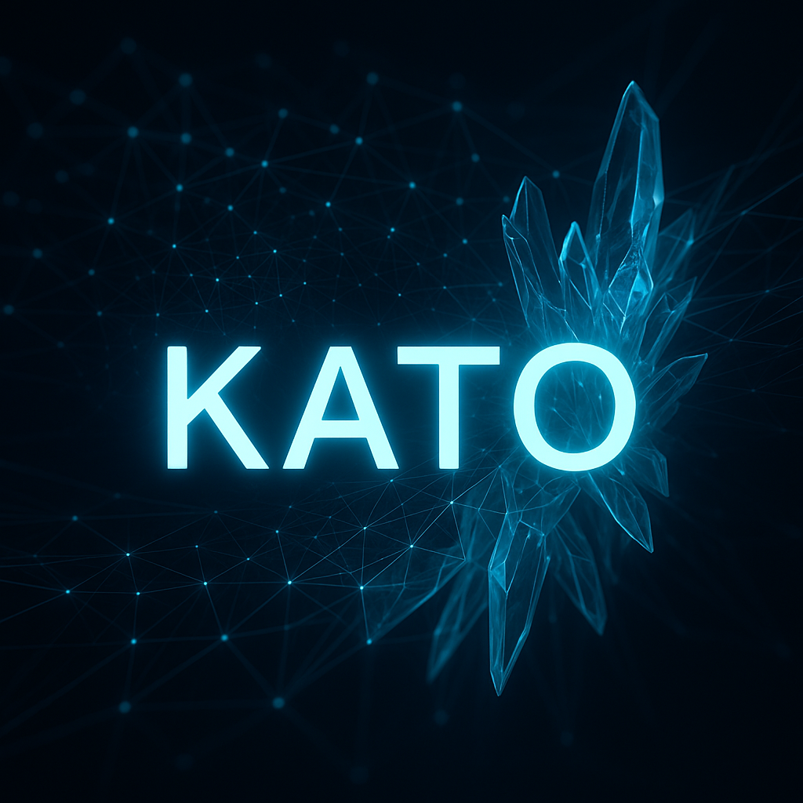
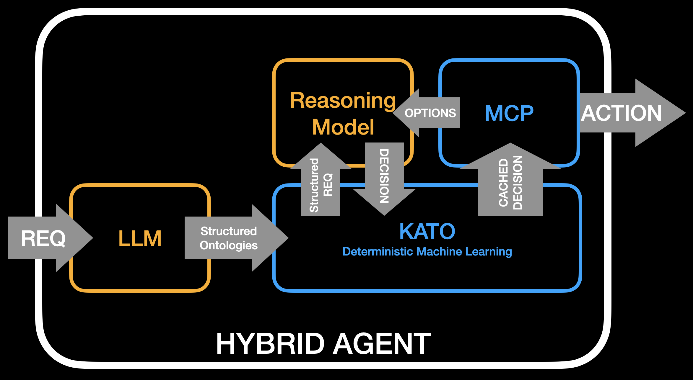

# KATO

**Knowledge Abstraction for Traceable Outcomes**

> *ExCITE-capable prediction engine for safety-critical and regulated AI systems — deterministic, explainable, and real-time correctable. Evolution of award-winning GAIuS sensor-fusion technology.*

🆕 **Latest Features**: Multi-user session isolation, guaranteed writes, Redis sessions, complete backwards compatibility

🎖️ **Heritage**: Evolved from GAIuS (Lockheed Martin Sikorsky Award Winner 2018) | Adheres to [ExCITE AI](https://medium.com/@sevakavakians/what-is-excite-ai-712afd372af4) principles



## Why KATO?

*Because in AI, memory without traceability or understanding is just confusion.*

KATO is intended to be the *Linux of AI*, providing not just open source code and configuration, but an analytical **cognitive computing** model that doesn’t require huge, power-hungry data centers. As an analytical model, KATO doesn’t require tremendous amounts of data to generate quality outcomes. Therefore, KATO models and agents can run locally, preserving privacy. Its deterministic machine learning algorithm is editable in real-time, guaranteeing the elimination of hallucinations and errors with each corrected pattern.

KATO is developed to work in highly regulated and/or mission-critical problem domains from which traditional GPT-based solutions are restricted. KATO’s algorithms *and* its knowledge bases (*i.e.* trained data) are completely transparent and auditable - table-stakes for AI regulation.

## What is KATO?

KATO is a neuro-symbolic, **deterministic AI/ML architecture** that provides transparent, explainable machine learning through pattern-based learning—an alternative approach to transformer architectures for applications requiring real-time learning, complete traceability, and computational efficiency without neural networks.

The “neuro” in KATO’s neuro-symbolic expresses its *connectionist* nature, wherein KATO agents can consist of a network of cognitive processor nodes. These cognitive processors are not simple neural network nodes, but complete, deterministic coherent processes that efficiently emulate cognitive functionality, rather than expensively simulate brain functions by replicating brain structures - as is the artificial neural network approach.

As an evolution of GAIuS (winner of Lockheed Martin's Sikorsky 8th Entrepreneurial Challenge Award in 2018), KATO inherits proven sensor-fusion capabilities and adheres to **[ExCITE AI principles](https://medium.com/@sevakavakians/what-is-excite-ai-712afd372af4)** (Explainable, Computable, Interpretable, Traceable, Editable). This makes KATO an **ExCITE-capable prediction engine** uniquely suited for safety-critical and highly regulated verticals where transparency, traceability, and real-time correction are mandatory.

While transformer-based models (GPT, Claude, LLaMA) excel at language understanding and creative generation, they come with fundamental limitations that make them unsuitable for many production AI systems. KATO fills these critical gaps by providing a **symbolic, pattern-based learning architecture** that learns incrementally, operates deterministically, and maintains complete traceability—all while running on commodity CPUs.

With the tremendous advances already made with transformer based architectures, **KATO isn't intended to replace transformers—it complements them.** Use transformers for language understanding and reasoning; use KATO for deterministic memory, pattern prediction, and fact-based generation. Together, they form a powerful hybrid architecture that combines the best of both approaches.

### Modern AI's Critical Limitations

Modern AI is built on transformer architectures that suffer from critical flaws:

- ❌ **Non-Deterministic** - Same input produces different outputs (sampling, temperature)
- ❌ **Unexplainable** - Billions of weights with no interpretable meaning
- ❌ **Static Knowledge** - Cannot learn new information without expensive retraining
- ❌ **GPU-Dependent** - Requires $10k-$30k hardware for inference
- ❌ **Hallucinations** - Generates plausible but incorrect information
- ❌ **Non-Correctable** - Fixing errors requires full model retraining

### KATO's Alternative Approach

- ✅ **100% Deterministic** - Same inputs always yield identical outputs
- ✅ **Fully Transparent** - Every prediction traces to source patterns
- ✅ **Real-Time Learning** - Learns from single observations instantly
- ✅ **CPU-Optimized** - Runs on $50/month VMs, no GPUs required
- ✅ **Fact-Based** - Only predicts from observed patterns, no hallucinations
- ✅ **Database-Editable** - Fix incorrect predictions with SQL UPDATE

### Pattern-Based Learning

KATO uses **patterns** as its core learning concept:
- **Temporal Patterns**: Time-ordered patterns with temporal dependencies
- **Profile Patterns**: Collections without temporal ordering requirements

Both are represented by the same pattern object which consists of sequences of events of symbols. Within each event, the symbols are alphanumerically sorted for stronger pattern matching. Between the events of a sequence, the ordering is kept as it was learned for correctness of the sequential pattern.

When the sequence matters, store symbols across events keeping their order. When the sequence doesn’t matter, store symbols within the same event. This allows the same representation to be used universally, i.e. in all use-cases.

Every learned structure in KATO is identified by a unique hash: `PTRN|<sha1_hash>`
(Note: In databases, patterns are stored as plain SHA1 hashes without the `PTRN|` prefix)

## Architecture Comparison: KATO vs Transformers

Understanding when to use KATO versus transformers is critical for building effective AI systems:

| Feature | Transformers (GPT-4, Claude) | KATO | Hybrid (KATO + LLM) |
|---------|------------------------------|------|---------------------|
| **Learning** | Batch pre-training on billions of tokens | Incremental learning from single observations | LLM for language, KATO for memory |
| **Hardware** | GPUs required ($1000s/month) | CPU-only ($50/month) | Reduced LLM calls = cost savings |
| **Explainability** | Black-box attention weights | Complete pattern traceability | Transparent decisions + language interface |
| **Determinism** | Non-deterministic (sampling) | 100% deterministic | Deterministic core + reasoning fallback |
| **Knowledge Updates** | Requires retraining | Direct database edits (SQL UPDATE) | Update patterns without retraining LLM |
| **Real-time Learning** | Not possible | Instant pattern learning | Adapt in production without downtime |
| **Regulatory Compliance** | Challenging (no audit trail) | Built-in (complete traceability) | Best of both worlds |
| **Startup Time** | 30-60 seconds (model loading) | 2-3 seconds | Fast initialization |
| **Memory** | 80GB+ GPU memory | 200-500MB RAM | Optimized resource usage |
| **Hallucinations** | Common (generates false info) | Impossible (fact-based only) | LLM for reasoning, KATO for facts |
| **Generation** | Creative, fluent, novel content | Fact-preserving recombination | Creativity + accuracy |

## Text Generation Without Hallucinations

### KATO-LM: Hierarchical Pattern-Based Generation

As an example use of KATO, a language model is built on it.

Unlike transformer-based language models that can generate plausible but false content ("hallucinations"), **KATO-LM generates text by sampling and unraveling actually observed patterns** from training data.

**How It Works**:
1. **Training**: Learn hierarchical patterns at multiple scales:
   - **node0**: Token chunks (15 tokens)
   - **node1**: Paragraphs (225 tokens)
   - **node2**: Chapters (3,375 tokens)
   - **node3**: Documents (50,625 tokens)

2. **Generation**: Sample high-level patterns using Markov chain probabilities, then unravel hierarchically to produce text

3. **Constraint**: Can only generate sequences that appeared (or are compositions of sequences that appeared) in training data

**Key Advantages Over Transformer Generation**:

- ✅ **Zero Hallucinations** - Cannot generate facts not present in training corpus
- ✅ **Complete Transparency** - Every generated token traceable to source pattern with frequency count
- ✅ **Deterministic** - Same seed + context → same output (fully reproducible)
- ✅ **Multi-Scale Control** - Generate at sentence, paragraph, chapter, or document level
- ✅ **Frequency-Based Sampling** - Explicit probability interpretation (pattern seen N times)

**Trade-offs**:
- Less creative than transformers (recombines learned patterns only)
- Requires training corpus to fully cover target domain
- Cannot synthesize novel facts or reasoning beyond training data

**Ideal Use Cases**:
- 🏥 Medical documentation (fact-critical, no fabrication)
- ⚖️ Legal text generation (precedent-based, traceable)
- 📊 Financial reports (accurate data reproduction)
- 🔬 Scientific writing (reproducible, explainable)
- 📋 Technical documentation (structured, pattern-based)

**Status**: Pattern learning infrastructure complete. Basic generation implemented. Advanced multi-scale sampling in active development.

**Learn more**: [KATO-LM Project](https://github.com/sevakavakians/kato-lm)

## When to Use KATO vs Transformers

### Choose KATO When:

- ✅ **Explainability is mandatory** (regulatory, safety-critical, compliance)
- ✅ **Deterministic behavior required** (testing, certification, reproducibility)
- ✅ **Real-time learning needed** (adapt from observations without retraining)
- ✅ **Cost efficiency matters** (no GPU budget, edge deployment)
- ✅ **Knowledge correction valuable** (fix errors post-deployment via database edits)
- ✅ **Temporal patterns primary** (sequences, workflows, time-series)
- ✅ **Multi-tenancy required** (isolated knowledge bases per user/organization)
- ✅ **Fact-based generation** (medical, legal, financial documentation)

### Choose Transformers When:

- ✅ **Open-ended generation primary** (creative writing, code generation, brainstorming)
- ✅ **Zero-shot learning needed** (handle completely novel domains)
- ✅ **Deep semantic understanding** (natural language nuance, context, ambiguity)
- ✅ **Transfer learning valuable** (leverage massive pre-training)
- ✅ **Fluency critical** (human-like text generation)

### Choose Hybrid Architecture (KATO + Transformer) When:

🤝 **Best of Both Worlds**:
- Natural language interface (transformer) + transparent decision-making (KATO)
- Language understanding (transformer) + deterministic memory (KATO)
- Creative reasoning (transformer) + fact-based generation (KATO)
- Reduced costs (LLM only when needed, KATO for pattern recall)
- Regulatory compliance (KATO audit trails) + user experience (LLM fluency)

**Hybrid Architecture Pattern**:
```
Natural Language Input
         ↓
   LLM (Language Understanding) ← Semantic comprehension, reasoning
         ↓
   KATO (Pattern Memory) ← Deterministic recall, fact-based prediction
         ↓
   Decision Engine ← Transparent, traceable actions
         ↓
   Action Execution
```

**Production Example**:
- **Customer Support Bot**: LLM understands user intent → KATO recalls relevant cases/solutions → LLM generates natural response
- **Medical Diagnosis Assistant**: LLM processes symptoms → KATO matches symptom patterns → LLM explains diagnosis (with full traceability)
- **Financial Advisory**: LLM understands client goals → KATO predicts portfolio patterns → LLM communicates recommendations

## KATO as Zettelkasten: A Digital Second Brain

### The Luhmann Connection

KATO's pattern-based architecture shares fundamental principles with German sociologist **Niklas Luhmann's Zettelkasten method**—a knowledge management system that enabled him to produce over 70 books and 400 scholarly articles through a meticulously interconnected slip-box of notes.

### Zettelkasten Principles in KATO

| Zettelkasten Principle | KATO Implementation | Benefit |
|------------------------|---------------------|---------|
| **Atomic Notes** | Each pattern is a discrete fact/observation | Single, testable unit of knowledge |
| **Permanent Referencing** | Unique pattern hash <code>PTRN&#124;&lt;sha1&gt;</code> | Immutable, globally unique identifiers |
| **Hypertextual Links** | Metadata cross-referencing + hierarchical pattern learning | Web of interconnected knowledge |
| **Communication Partner** | Query/prediction system | "Converse" with your knowledge base |

### How KATO Extends Zettelkasten

**1. Atomic Facts with Pattern Names**

Each KATO pattern represents a single, atomic observation—just like Luhmann's index cards:

```python
# Single atomic fact
observe([["Paris", "capital", "France"]])
learn()  # → PTRN|a1b2c3d4 (permanent, unique identifier)

# Another atomic fact
observe([["Eiffel_Tower", "located_in", "Paris"]])
learn()  # → PTRN|e5f6g7h8
```

**2. Cross-Referencing via Metadata**

Like Luhmann's card references, KATO's metadata field enables explicit knowledge linking:

```python
# Learn fact with source reference
observe(
    [["penicillin", "discovered_by", "Fleming"]],
    metadata={"source": "doi:10.1038/...", "related_to": ["PTRN|antibiotics"]}
)

# Query returns pattern with full lineage
predictions = get_predictions()  # Includes metadata provenance
```

**3. Hierarchical Knowledge Organization**

Patterns can be learned together to form hierarchical knowledge structures:

```python
# Learn related facts in sequence (automatically linked)
observe([["France", "country"]])
observe([["Paris", "capital", "France"]])  # Implicitly related through sequence
observe([["Eiffel_Tower", "landmark", "Paris"]])
learn()  # Single pattern linking all three facts hierarchically
```

**4. Communication Partner: Your "Second Brain"**

Like Luhmann's slip-box serving as an "alter ego," KATO becomes an intelligent conversation partner:

```python
# Ask your knowledge base
observe([["patient", "symptoms", "fever", "cough"]])
predictions = get_predictions()

# KATO "responds" with relevant patterns:
# → Past cases with similar symptoms
# → Diagnosed conditions
# → Treatment outcomes
# All traceable to source patterns
```

### KATO vs Traditional Zettelkasten

| Aspect | Luhmann's Zettelkasten | KATO Digital Zettelkasten |
|--------|------------------------|---------------------------|
| **Medium** | Physical index cards | Digital patterns in database |
| **Scale** | ~90,000 cards (lifetime) | Unlimited (billions of patterns) |
| **Search** | Manual browsing + references | Instant pattern matching (<100ms) |
| **Links** | Manual cross-references | Automatic via metadata + hierarchy |
| **Predictions** | Human insight required | Algorithmic pattern completion |
| **Temporal** | Static notes | Temporal sequences captured |
| **Multi-modal** | Text only | Text + vectors + emotives + metadata |
| **Collaboration** | Single-user slip-box | Multi-tenant with kb_id isolation |

### Knowledge Management Use Cases

**Personal Knowledge Management (PKM)**:
- Research notes with automatic cross-referencing
- Reading highlights linked to source materials
- Idea development through pattern completion
- Literature review with traceable citations

**Team Knowledge Bases**:
- Organizational memory across employees
- Onboarding knowledge capture
- Best practices documentation
- Lessons learned repositories

**Research & Academia**:
- Literature review automation
- Citation network mapping
- Hypothesis generation from patterns
- Research lineage tracking

**Example: Research Note System**

```python
# Capture atomic research notes
observe([["Luhmann", "created", "Zettelkasten"]],
        metadata={"source": "Schmidt_2016", "tags": ["PKM", "methodology"]})
learn()  # → PTRN|abc123

observe([["Zettelkasten", "enables", "emergent_thinking"]],
        metadata={"source": "Ahrens_2017", "related_to": ["PTRN|abc123"]})
learn()  # → PTRN|def456

# Query for related concepts
observe([["knowledge_management", "methods"]])
predictions = get_predictions()
# Returns both patterns with full metadata provenance
```

### The "Second Brain" Advantage

Luhmann's Zettelkasten was revolutionary because it became a **thinking partner**—not just storage, but a tool for generating new insights through emergent connections. KATO extends this concept:

- **Automated Discovery**: Pattern matching reveals connections you might miss
- **Temporal Understanding**: Captures not just facts but sequences and processes
- **Scalable Insight**: Works with billions of patterns, not thousands
- **Traceable Provenance**: Every insight links back to source materials
- **Real-Time Learning**: Grows with you, adapting to new knowledge instantly

### Building Your Digital Zettelkasten

KATO transforms Luhmann's analog methodology into a **deterministic, scalable, and queryable knowledge system** that maintains the core principles while adding computational power—creating a true "second brain" for the digital age.

## KATO for Regulated Verticals & Safety-Critical Systems

### Why Highly Regulated Industries Choose KATO

In domains where errors have serious consequences—healthcare, aerospace, defense, finance, manufacturing—AI systems must meet stringent requirements that transformer-based models simply cannot satisfy. KATO was specifically designed for these demanding environments.

**Regulatory Compliance Built-In**:
- ✅ **Complete Audit Trails** - Every prediction traceable to source patterns (GDPR Article 22, HIPAA, SOX, Basel III)
- ✅ **Explainable Decisions** - Stakeholders understand "why" without technical expertise
- ✅ **Real-Time Correction** - Fix errors immediately via database updates (no retraining downtime)
- ✅ **Deterministic Behavior** - Same inputs always produce same outputs (required for certification: DO-178C, IEC 62304, ISO 26262)
- ✅ **Validation & Verification** - Pattern-based logic can be formally tested and certified

### Sensor Fusion for Mission-Critical Applications

Building on GAIuS's award-winning sensor-fusion capabilities (Lockheed Martin Sikorsky 8th Entrepreneurial Challenge Award 2018), KATO excels at integrating multiple sensor streams in real-time:

**Multi-Sensor Integration**:
- 📹 **Vision Systems** - Process image embeddings alongside sensor data
- 📡 **IoT Sensor Streams** - Temperature, pressure, vibration, position data
- 🎙️ **Audio/Speech** - Voice commands, environmental audio analysis
- 📊 **Time-Series Data** - Equipment telemetry, vital signs monitoring
- 🗺️ **Geospatial Data** - Location-based pattern recognition

**Example Applications**:
```python
# Aerospace: Multi-sensor anomaly detection
observe([
    ["altitude|3500", "speed|250", "temp|normal"],  # Flight data
    ["VCTR|image_embed_123"],                       # Vision system
    ["vibration|0.2", "fuel|80pct"]                # Sensor readings
])
predictions = get_predictions()  # Detects patterns indicating maintenance needs

# Healthcare: Patient monitoring
observe([
    ["heart_rate|95", "bp|normal", "temp|98.6"],   # Vital signs
    ["patient_restless", "night_shift"],            # Nurse observations
    ["VCTR|ecg_pattern_456"]                        # ECG embedding
])
predictions = get_predictions()  # Predicts patient deterioration risks
```

### Transparent Predictions with Real-Time Correction

**Production Scenario: Medical Device Monitoring**
```bash
# Initial pattern learned from device behavior
Context: ["device|XR100", "temp|rising", "vibration|high"]
Prediction: ["continue_operation", "schedule_maintenance"]

# Device fails unexpectedly - pattern was incorrect
# Immediate correction without system downtime:
UPDATE patterns_data
SET pattern_data = [['emergency_shutdown', 'immediate_inspection']]
WHERE kb_id = 'medical_devices' AND name = 'pattern_abc123';

# Next occurrence → corrected action immediately applied
# Full audit trail maintained for regulatory review
```

**Key Benefits for Regulated Industries**:
1. **No Regulatory Approval Delays** - Update knowledge without retraining/recertification
2. **Post-Market Surveillance** - Learn from field data and adapt in real-time
3. **Incident Investigation** - Complete traceability for root cause analysis
4. **Risk Mitigation** - Database-level corrections prevent recurring errors
5. **Stakeholder Confidence** - Explainable decisions for non-technical decision-makers

### Industry-Specific Applications

**Healthcare & Medical Devices**:
- Patient deterioration prediction (ICU monitoring)
- Medical device anomaly detection
- Clinical decision support with audit trails
- Adverse event prediction and prevention

**Aerospace & Defense**:
- Aircraft health monitoring (predictive maintenance)
- Multi-sensor fusion for situational awareness
- Flight data analysis with full traceability
- Autonomous system decision-making

**Financial Services**:
- Fraud detection with explainable scoring
- Trading pattern recognition (compliance-ready)
- Risk assessment with complete audit trails
- Regulatory reporting automation

**Manufacturing & Industrial IoT**:
- Predictive maintenance (equipment failure prediction)
- Quality control with traceable decisions
- Supply chain optimization
- Process anomaly detection

**Autonomous Vehicles & Robotics**:
- Sensor fusion for perception systems
- Deterministic decision-making for safety certification
- Real-time learning from edge cases
- Transparent behavior for regulatory approval

### Key Features

- ✨ **Deterministic Learning** - Same inputs always yield same outputs
- 🔍 **Full Transparency** - All internal states and decisions are explainable
- 🎯 **Temporal Predictions** - Sophisticated past/present/future segmentation
- 🧠 **Multi-Modal Sensor Fusion** - Integrate text, vectors, vision systems, and multiple sensor streams
- 🎖️ **Award-Winning Technology** - Evolved from GAIuS (Lockheed Martin Sikorsky Challenge Winner 2018)
- 📋 **ExCITE AI Compliant** - Explainable, Correctable, Incremental, Traceable, Efficient
- ⚡ **High Performance** - 3.57x throughput, 72% latency reduction, comprehensive optimizations
- 🔄 **Stateful Processing** - Maintains context across observations
- 🎪 **Vector Database** - Modern vector search with Qdrant (10-100x faster)
- 👥 **Multi-User Sessions** - Complete STM isolation per user session
- 💾 **Write Guarantees** - ClickHouse and Redis ensure data durability
- 🔐 **Session Management** - Redis-backed sessions with TTL and isolation
- 📊 **Session Isolation** - Each session has completely isolated state

### Comparative Advantages

**vs Transformer Models:**
- **Explainability**: Complete audit trail vs black-box weights
- **Learning**: Single observation vs billions of examples
- **Hardware**: CPU-only vs GPU-dependent
- **Determinism**: Reproducible vs stochastic
- **Correctability**: Database edits vs full retraining
- **Cost**: $50/month vs $1000s/month
- **Hallucinations**: Fact-based only vs common

**vs Traditional ML:**
- **Real-time Learning**: Instant pattern updates vs batch retraining
- **Transparency**: Traceable patterns vs feature weights
- **Multi-modal**: Unified event model vs separate pipelines
- **Scalability**: Stateless horizontal scaling vs stateful challenges

### Hybrid AI Architecture: The Future of Production Systems



**Combining KATO with transformer-based models creates a powerful hybrid architecture** that addresses the fundamental limitations of pure neural approaches while maintaining the benefits of natural language understanding.

#### The Problem with Pure Transformer Systems

Black-box stochastic processes like Generative Pre-trained Transformers (GPT), Large Language Models (LLMs), Small Language Models (SLMs), and GPT-based reasoning models suffer from critical issues:

- **Hallucinations**: Generate plausible but incorrect information without indication
- **Inconsistent Outputs**: Same input produces different outputs (non-deterministic)
- **Hidden Biases**: Learned biases from training data without transparency
- **High Training Costs**: Billions of dollars for large-scale pre-training
- **High Operational Costs**: GPU inference at scale is expensive
- **No Guardrails**: Cannot guarantee outputs stay within acceptable bounds
- **No Remediation**: Fixing errors requires expensive retraining cycles

#### KATO's Solution: Deterministic Memory Layer

KATO provides a **deterministic pattern-based learning layer** that learns context + action + outcome patterns, effectively:

1. **Caching for Reduced LLM Calls**: Store proven patterns for instant recall (orders of magnitude faster + cheaper)
2. **Traceable Database Storage**: All patterns stored in ClickHouse with complete audit trails
3. **Real-Time Learning**: Adapt to new patterns instantly without retraining
4. **Database-Editable Knowledge**: If an action needs correction, simply edit the pattern in the database—changes take effect immediately

**Example Workflow**:
```bash
# Pattern learned from experience
Context: ["user_frustrated", "payment_failed", "mobile_app"]
Action: ["escalate_to_human", "offer_refund"]
Outcome: ["issue_resolved", "satisfaction_score_9"]

# If action proves incorrect, fix with SQL:
UPDATE patterns_data
SET pattern_data = [['new', 'correct', 'action']]
WHERE kb_id = 'production' AND name = 'pattern_hash';

# Next time same context appears → corrected action (no retraining)
```

#### Key Benefits of Hybrid Architecture

- ✅ **Cost Optimization**: Use LLM only for language understanding, KATO for memory/prediction (10-100x cost reduction)
- ✅ **Transparency**: Every decision traceable to source patterns (regulatory compliance)
- ✅ **Adaptability**: Learn from production experience in real-time
- ✅ **Guardrails**: Pattern-based constraints prevent harmful outputs
- ✅ **Remediation**: Fix errors via database edits, no retraining cycles
- ✅ **Best UX**: Natural language interface (LLM) + reliable memory (KATO)

## Performance Optimizations

### CPU-Powered Intelligence at GPU-Scale Speed

KATO achieves transformer-competitive performance on commodity CPUs through advanced algorithmic optimizations—no GPUs required. This makes KATO ideal for cost-sensitive deployments, edge computing, and organizations without GPU infrastructure.

KATO has been extensively optimized for production use with comprehensive performance enhancements:

### 🚀 Performance Metrics
- **3.57x throughput improvement** (from 57 to 204 observations/second)
- **72% latency reduction** (from 439ms to 123ms average)  
- **97% network overhead reduction** through batch optimization
- **Linear scaling** with batch size for predictable performance

### 🔧 Optimization Features
- **Bloom Filter Pre-screening**: O(1) pattern candidate filtering eliminates 99% of unnecessary computations
- **Redis Pattern Caching**: 80-90% cache hit rate for frequently accessed patterns
- **ClickHouse Filter Pipeline**: Multi-stage filtering (MinHash/LSH/Bloom) for billion-scale performance
- **Connection Pool Optimization**: 60-80% reduction in connection overhead
- **Distributed STM Management**: Redis Streams for scalable state coordination
- **Async Parallel Processing**: Multi-core pattern matching with AsyncIO

### 📊 Monitoring Endpoints
Real-time performance monitoring available at:
- `/performance-metrics` - Complete system performance and database stats
- `/connection-pools` - Connection pool health and statistics  
- `/cache/stats` - Redis cache performance metrics
- `/distributed-stm/stats` - Distributed STM performance monitoring

### 📈 Benchmarking Results
| Batch Size | Throughput (obs/sec) | Latency (ms) | Improvement |
|------------|---------------------|---------------|-------------|
| 10 obs     | 203.71 vs 57.00     | 122.73 vs 438.62 | **3.57x** |
| 50 obs     | 406.50 vs 114.29    | 49.09 vs 175.32  | **3.56x** |
| 100 obs    | 658.68 vs 185.19    | 30.35 vs 108.11  | **3.56x** |

See `docs/archive/optimizations/` for detailed benchmarks and implementation details.

## Prerequisites

### System Requirements
- Docker and Docker Compose
- Python 3.9+ (for local development)
- 4GB+ RAM recommended
- ClickHouse (auto-started with Docker)
- Qdrant Vector Database (auto-started with Docker)
- Redis (auto-started with Docker)

### Required Python Packages (for development)
```bash
pip install -r requirements.txt
pip install -r tests/requirements.txt
```

## Installation Options

### Option 1: Using Pre-Built Container Images (Recommended)

KATO provides official pre-built container images hosted on GitHub Container Registry. This is the fastest way to get started.

#### Available Image Tags

| Tag | Description | Use Case |
|-----|-------------|----------|
| `3.4.0` | Specific version (immutable) | Production - pin to exact version |
| `3.4` | Latest patch for 3.4.x | Auto-receive security/bug fixes |
| `3` | Latest minor for 3.x | Track major version |
| `latest` | Latest stable release | Development and testing |

#### Pull Pre-Built Image

```bash
# Recommended for production - pin to specific version
docker pull ghcr.io/sevakavakians/kato:3.4.0

# Auto-receive patch updates (security fixes, bug fixes)
docker pull ghcr.io/sevakavakians/kato:3.4

# Always use latest stable (for development)
docker pull ghcr.io/sevakavakians/kato:latest
```

#### Use with Docker Compose

Modify your `docker compose.yml` to use pre-built images:

```yaml
services:
  kato:
    image: ghcr.io/sevakavakians/kato:3.4.0  # Use pre-built image
    # Remove 'build' section
    container_name: kato
    environment:
      - SERVICE_NAME=kato
      # ... rest of environment variables
```

See the [Deployment Guide](docs/operations/docker-deployment.md) for complete instructions on using pre-built images.

### Option 2: Build from Source

If you need to modify the code or contribute to development, build from source.

## Quick Start

### 1. Clone Repository
```bash
# Clone repository
git clone https://github.com/sevakavakians/kato.git
cd kato
```

### 2. Start Services
```bash
# Start all services (includes ClickHouse, Qdrant, Redis, KATO)
./start.sh

# Services will be available at:
# - KATO Service: http://localhost:8000
# - ClickHouse: http://localhost:8123
# - Qdrant: http://localhost:6333
# - Redis: redis://localhost:6379
```

### 3. Verify Installation
```bash
# Check health
curl http://localhost:8000/health

# Response:
# {"status": "healthy", "service_name": "kato", "uptime_seconds": 123.45, ...}

# Quick test of basic functionality
./run_tests.sh --no-start --no-stop tests/tests/api/test_fastapi_endpoints.py::test_health_endpoint -v

# Check API documentation
# Open in browser: http://localhost:8000/docs
```

### 4. Basic Usage

#### Option A: Using Sessions (Recommended)
```bash
# Create a session for node isolation
SESSION=$(curl -s -X POST http://localhost:8000/sessions \
  -H "Content-Type: application/json" \
  -d '{"node_id": "alice"}' | jq -r '.session_id')

# Observe in isolated session
curl -X POST http://localhost:8000/sessions/$SESSION/observe \
  -H "Content-Type: application/json" \
  -d '{"strings": ["hello", "world"]}'

# Get session's isolated STM
curl http://localhost:8000/sessions/$SESSION/stm
```

**💾 Data Persistence Note:**
- Your `node_id` ("alice") is your **persistent identifier** - using the same `node_id` later will reconnect to all trained patterns
- Sessions (STM, emotives) are temporary and expire, but learned patterns in ClickHouse persist forever
- See [Database Persistence Guide](docs/users/database-persistence.md) for complete details

## Core Concepts

KATO processes observations as **events** containing strings, vectors, and emotives. Each event is processed through:
- **Alphanumeric sorting** within events
- **Deterministic hashing** for patterns (`PTRN|<sha1_hash>`)
- **Temporal segmentation** in predictions
- **Empty event filtering**
- **Minimum requirement**: 1+ strings in STM for predictions (single-symbol fast path available; vectors contribute strings)

Learn more in [Core Concepts](docs/developers/concepts.md) or [User Guide](docs/users/concepts.md).

## Service Management

### Starting and Stopping
```bash
# Start all services
./start.sh

# Stop all services
docker compose down

# Restart services
docker compose restart

# Check status
docker compose ps
```

### Health Monitoring
```bash
# Check service health
curl http://localhost:8000/health

# View logs
docker compose logs                # All services
docker compose logs kato           # KATO service
docker logs kato --tail 50         # Direct Docker logs
```

## Testing

KATO uses a simplified test architecture where tests run in local Python and connect to running services:

### Prerequisites for Testing
```bash
# Services must be running first
./start.sh

# Set up Python environment (one-time setup)
python3 -m venv venv
source venv/bin/activate
pip install -r requirements.txt
pip install -r tests/requirements.txt
```

### Running Tests
```bash
# Run all tests (services must be running)
./run_tests.sh --no-start --no-stop

# Run specific test suite
./run_tests.sh --no-start --no-stop tests/tests/unit/
./run_tests.sh --no-start --no-stop tests/tests/integration/
./run_tests.sh --no-start --no-stop tests/tests/api/

# Run specific test file
./run_tests.sh --no-start --no-stop tests/tests/unit/test_sorting_behavior.py

# Run with verbose output
./run_tests.sh --no-start --no-stop -v tests/tests/unit/

# Run tests with fresh KATO (slower but cleaner)
./run_tests.sh  # Will start/stop services automatically
```

### Test Architecture
- **No Docker in Tests**: Tests run in local Python, connect to running KATO service
- **Automatic Isolation**: Each test gets unique processor_id for complete isolation
- **Fast Iteration**: Direct Python execution allows debugging with print/breakpoints
- **Parallel Safe**: Tests can run in parallel thanks to processor_id isolation

**Current Status**: 445+ tests (2 intentionally skipped) across unit, integration, API, and performance suites

See [Testing Guide](docs/developers/testing.md) for complete details.

## Documentation


### 📚 Tutorials
- [Jupyter Notebook Tutorials](https://github.com/sevakavakians/kato-tutorials) - Various dataset examples and repeatable usage patterns.

### 📚 Getting Started
- [Quick Start Guide](docs/users/quick-start.md) - Get running in 5 minutes
- [API Reference](docs/users/api-reference.md) - Complete endpoint documentation
- [Configuration Management](docs/developers/configuration-management.md) - Comprehensive configuration system guide
- [Configuration Guide](docs/operations/configuration.md) - All environment variables
- [Glossary](docs/reference/glossary.md) - Terms and concepts defined
- [Multi-Instance Guide](docs/operations/multi-instance.md) - Run multiple KATO processors
- [Network Topology Patterns](docs/operations/network-topology.md) - Connect instances in various topologies
- [User Guide](docs/users/concepts.md) - Understand the architecture and usage
- [Developer Concepts](docs/developers/concepts.md) - Learn KATO's internal behavior

### 🚀 Deployment
- [Docker Guide](docs/operations/docker-deployment.md) - Container deployment
- [Configuration](docs/operations/configuration.md) - All parameters explained
- [Architecture](docs/developers/architecture.md) - System design
- [Production Scale Migration Plan (PSMP)](docs/deployment/PRODUCTION_SCALE_MIGRATION_PLAN.md) - Future scaling strategy for production workloads

### 🔧 Development
- [API Reference](docs/users/api-reference.md) - Complete endpoint documentation
- [Testing Guide](docs/developers/testing.md) - Write and run tests
- [Contributing](docs/developers/contributing.md) - Development guidelines

### 📊 Technical
- [Performance Guide](docs/developers/performance-profiling.md) - Optimization strategies
- [Troubleshooting](docs/maintenance/known-issues.md) - Common issues
- [Prediction Object Reference](docs/technical/PREDICTION_OBJECT_REFERENCE.md) - Complete field documentation
- [Known Issues](docs/maintenance/known-issues.md) - Current bugs and workarounds

### 📁 Documentation Structure

```
docs/
├── 00-START-HERE.md         # 📍 Start here - Central navigation hub
├── users/                   # 👤 End user documentation
│   ├── quick-start.md       # 5-minute quick start
│   ├── api-reference.md     # Complete API docs
│   ├── database-persistence.md # Data persistence
│   ├── concepts.md          # User-facing concepts
│   └── migration-guides/    # Version migration guides
├── developers/              # 💻 Core contributor documentation
│   ├── testing.md           # Complete testing guide
│   ├── concepts.md          # Internal concepts
│   └── configuration-management.md # Config system
├── operations/              # 🔧 DevOps and deployment
│   ├── configuration.md     # All parameters
│   ├── container-deployment.md # Container management
│   ├── multi-instance.md    # Multi-instance setup
│   └── network-topology.md  # Network patterns
├── research/                # 🔬 Algorithm and theory
│   ├── pattern-matching.md  # Pattern algorithms
│   ├── predictive-information.md # Prediction theory
│   ├── emotives-processing.md # Emotional context
│   └── metadata-processing.md # Metadata handling
├── integration/             # 🔌 Integration patterns
│   ├── hybrid-agents-analysis.md # LLM integration
│   └── websocket-integration.md # WebSocket patterns
├── maintenance/             # 🛠️ Project maintenance
│   └── known-issues.md      # Current bugs/workarounds
├── reference/               # 📖 Quick reference
│   └── glossary.md          # Terms and definitions
├── archive/                 # 📦 Historical documentation
│   ├── optimizations/       # Past optimization work
│   └── investigations/      # Research archives
├── deployment/              # Legacy deployment docs
│   ├── ARCHITECTURE.md
│   ├── CONFIGURATION.md
│   └── DOCKER.md
├── development/             # Legacy development docs
│   └── CONTRIBUTING.md
└── technical/               # Legacy technical docs
    ├── PERFORMANCE.md
    ├── TROUBLESHOOTING.md
    └── PREDICTION_OBJECT_REFERENCE.md
```

## Architecture Overview

### FastAPI Architecture
KATO uses a simplified FastAPI architecture with embedded processors:

```
Client Request → FastAPI Service (Port 8000) → Embedded KATO Processor
                           ↓                                    ↓
                    Async Processing              ClickHouse, Qdrant & Redis
                           ↓                       (Isolated by session_id)
                    JSON Response
```

**Key Improvements:**
- **Direct Embedding**: KATO processor runs in same process as API
- **No Connection Issues**: Eliminated state management problems
- **Better Performance**: No inter-process communication overhead
- **Simpler Debugging**: Single process, clear stack traces
- **Full Async Support**: FastAPI's async capabilities for high concurrency

### Session Isolation
Each session maintains complete isolation:
- **Redis**: Session state isolated by session_id
- **ClickHouse**: Patterns isolated by kb_id partitioning
- **Qdrant**: Vectors isolated by session collection
- **In-Memory**: Per-session caches and state

## Configuration

KATO uses environment variables for configuration with Pydantic-based validation.

### Key Configuration Parameters

```bash
# Database
CLICKHOUSE_HOST="localhost"
CLICKHOUSE_PORT=8123
CLICKHOUSE_DB="kato"
QDRANT_HOST="localhost"
REDIS_URL="redis://localhost:6379/0"

# Learning
MAX_PATTERN_LENGTH=0        # Auto-learn after N observations (0=manual)
RECALL_THRESHOLD=0.1        # Pattern matching threshold (0.0-1.0)
PERSISTENCE=5               # Emotive value window size
STM_MODE="CLEAR"            # STM mode after auto-learn (CLEAR/ROLLING)

# Processing
MAX_PREDICTIONS=100         # Maximum predictions to return
PROCESS_PREDICTIONS=true    # Enable prediction processing
RANK_SORT_ALGO="potential"  # Prediction ranking metric

# Sessions
SESSION_TTL=3600            # Session time-to-live (seconds)
SESSION_AUTO_EXTEND=true    # Auto-extend TTL on access

# API
LOG_LEVEL="INFO"            # Logging level
PORT=8000                   # API port
```

### Session Configuration

Each session can have independent configuration:

```bash
# Update session config
curl -X POST http://localhost:8000/sessions/{session_id}/config \
  -H "Content-Type: application/json" \
  -d '{"config": {"recall_threshold": 0.5, "max_predictions": 50}}'
```

For complete configuration details, see [Configuration Guide](docs/operations/configuration.md).

## API Reference

### Quick Start

> **⚠️ All operations require session-based endpoints** (Phase 3 migration complete).

```bash
# 1. Create session
curl -X POST http://localhost:8000/sessions \
  -H "Content-Type: application/json" \
  -d '{"node_id": "user_alice"}'

# 2. Observe
curl -X POST http://localhost:8000/sessions/{session_id}/observe \
  -H "Content-Type: application/json" \
  -d '{"strings": ["hello", "world"]}'

# 3. Learn pattern
curl -X POST http://localhost:8000/sessions/{session_id}/learn

# 4. Get predictions
curl http://localhost:8000/sessions/{session_id}/predictions
```

### Key Endpoints

| Endpoint | Method | Description |
|----------|--------|-------------|
| `/sessions` | POST | Create new session |
| `/sessions/{id}/observe` | POST | Add observation |
| `/sessions/{id}/learn` | POST | Learn pattern |
| `/sessions/{id}/predictions` | GET | Get predictions |
| `/sessions/{id}/stm` | GET | View STM |
| `/sessions/{id}/config` | POST | Update config |
| `/health` | GET | Health check |
| `/metrics` | GET | Performance metrics |

**Full Documentation:**
- API Reference: [docs/users/api-reference.md](docs/users/api-reference.md)
- Interactive Docs: http://localhost:8000/docs

## Performance

### Current Performance Metrics
- **Latency**: 1-5ms per observation (single-instance, pre-warmed cache)
- **Throughput**: 200+ observations/second per instance (benchmarked)
- **Memory**: 200MB-500MB per processor
- **Startup Time**: 2-3 seconds
- **Vector Search**: 10-100x faster with Qdrant

### Scaling
- **Vertical**: Increase resources for individual containers
- **Horizontal**: Run multiple KATO instances on different ports
- **Load Balancing**: Use nginx or similar for distributing requests

See [Performance Guide](docs/developers/performance-profiling.md) for optimization.

## Troubleshooting

### Common Issues

#### Services Won't Start
```bash
# Check if ports are in use
lsof -i :8000
lsof -i :8123
lsof -i :6333
lsof -i :6379

# Clean restart
docker compose down
docker compose up -d
```

#### Tests Failing
```bash
# Ensure services are running
docker compose ps

# Check service health
curl http://localhost:8000/health

# Restart if needed
docker compose restart
```

#### Memory Issues
```bash
# Check Docker resources
docker system df
docker system prune -f

# Restart with fresh state
docker compose down
docker volume prune -f
./start.sh
```

#### ClickHouse Init Container Exits After Startup
**This is expected behavior.** The `clickhouse-init` container is designed to:
1. Start up when ClickHouse is ready
2. Initialize the ClickHouse database schema
3. Exit successfully (with status code 0)
4. Remain in "Exited" state

This is an initialization container that only needs to run once. You can verify it completed successfully:
```bash
# Check exit status (should show "Exited (0)")
docker ps -a | grep clickhouse-init

# View initialization logs
docker logs kato-clickhouse-init
```

The main ClickHouse container (`kato-clickhouse`) will continue running normally. Only the init container stops after completing its setup task.

See [Known Issues](docs/maintenance/known-issues.md) for more solutions.

## Contributing

We welcome contributions! Please see our [Contributing Guide](docs/developers/contributing.md) for:
- Development setup
- Code guidelines
- Testing requirements
- Pull request process

## License

This project is licensed under the terms in the [LICENSE](LICENSE) file.

## Heritage

KATO is derived from the [GAIuS](https://medium.com/@sevakavakians/what-is-gaius-a-responsible-alternative-to-neural-network-artificial-intelligence-part-1-of-3-1f7bbe583a32) framework, which won **Lockheed Martin's Sikorsky 8th Entrepreneurial Challenge Award in 2018** for its unique sensor-fusion capabilities. KATO retains GAIuS's transparent, symbolic, and physics-informed learning process while focusing on deterministic memory and abstraction for production AI systems.

### Award-Winning Sensor Fusion

The 2018 Lockheed Martin Sikorsky award recognized GAIuS's breakthrough approach to integrating multiple sensor streams—vision systems, telemetry, audio, and environmental data—into a unified, explainable prediction framework. KATO inherits and extends these proven capabilities, making it uniquely suited for mission-critical applications in aerospace, defense, healthcare, and industrial IoT.

### ExCITE AI Principles

Like GAIuS before it, KATO adheres to [ExCITE AI](https://medium.com/@sevakavakians/what-is-excite-ai-712afd372af4) principles:
- **Explainable** - Every prediction traceable to source patterns
- **Correctable** - Real-time knowledge updates via database edits
- **Incremental** - Learn from single observations instantly
- **Traceable** - Complete audit trails for regulatory compliance
- **Efficient** - CPU-only operation, no GPU requirements

## Recent Updates

### v3.4.0 (2026-03)
- **Database Authentication**: Optional authentication support for ClickHouse, Redis, and Qdrant
- **Qdrant Fix**: Prevent empty API key from blocking vector operations

### v3.3.0 (2026-02)
- **Redis OOM Protection**: Comprehensive memory monitoring and Redis protection
- **Manager Enhancements**: Memory monitoring, clean-data schema recreation
- **Request Limit**: Increased uvicorn request limit from 10k to 100k for training workloads

### v3.2.0 (2026-01)
- **Single-Symbol Predictions**: 1+ STM prediction support with fast path optimization
- **ClickHouse Memory Fix**: Prevent system log bloat causing memory exhaustion
- **Semantic Version Display**: Version display in kato-manager.sh

### v3.1.0 (2025-12)
- **Fuzzy Token Matching**: Token-level similarity matching with configurable threshold
- **RapidFuzz Integration**: 5-10x faster similarity calculation

## Support

- 📖 [Documentation](docs/) - Complete documentation
- 🐛 [Issue Tracker](https://github.com/sevakavakians/kato/issues) - Report bugs
- 💬 [Discussions](https://github.com/sevakavakians/kato/discussions) - Ask questions

---

*Because in AI, memory without traceability or understanding is just confusion.*
