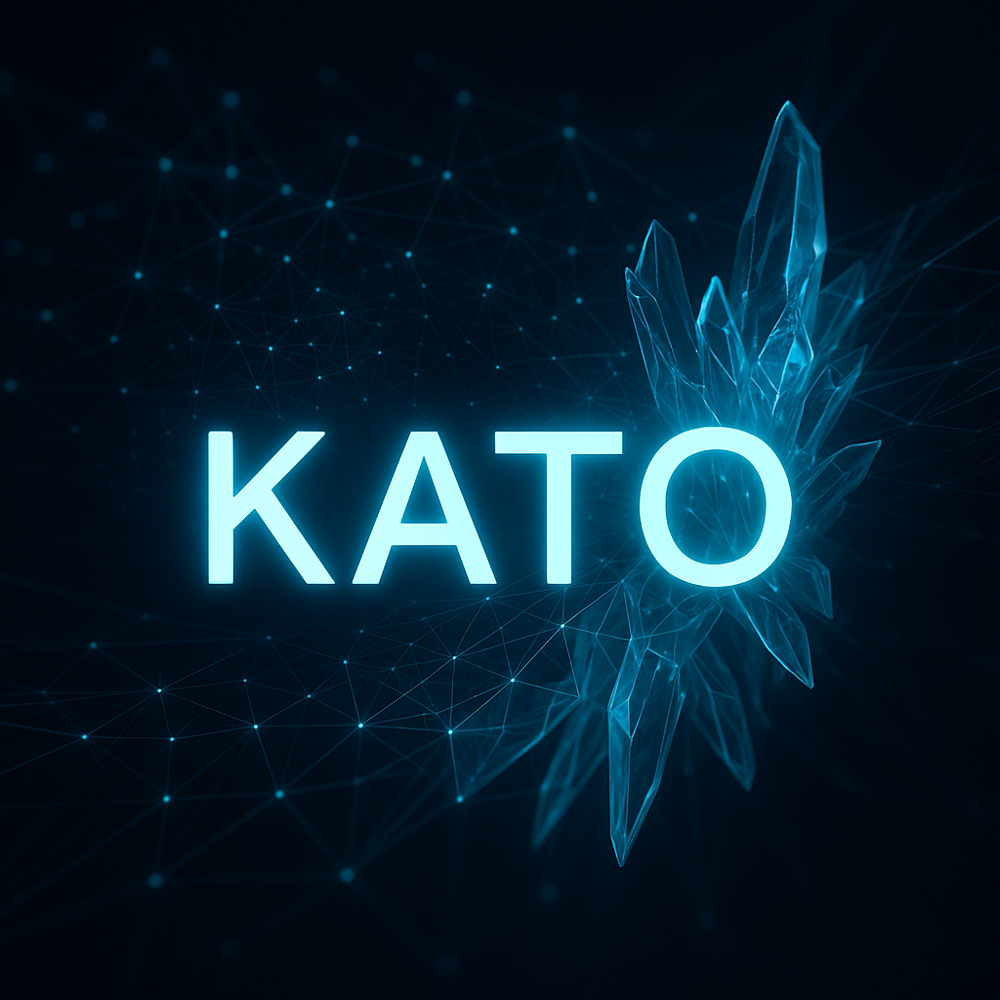
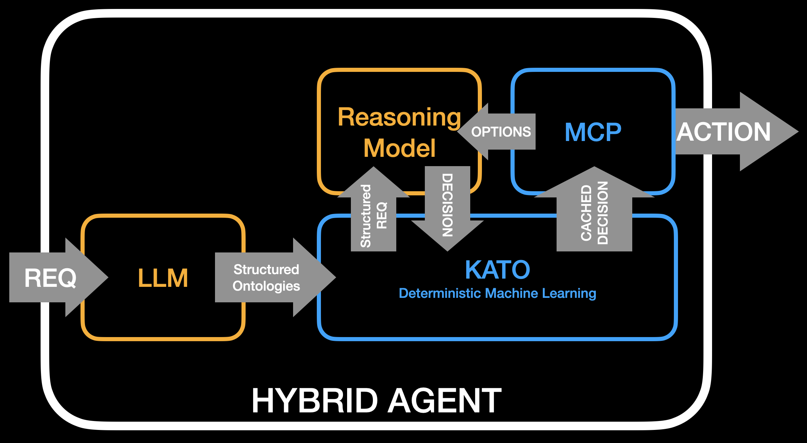

# KATO

**Knowledge Abstraction for Traceable Outcomes**

> *Deterministic, explainable **predictive AI** for safety-critical and regulated systems. KATO learns patterns from observations and predicts what comes next — with every prediction traceable to its source, correctable in real time. Evolution of award-winning GAIuS sensor-fusion technology.*

🆕 **Latest Features**: Multi-user session isolation, guaranteed writes, Redis sessions, complete backwards compatibility

🎖️ **Heritage**: Evolved from GAIuS (Lockheed Martin Sikorsky Award Winner 2018) | Adheres to [ExCITE AI](https://medium.com/@sevakavakians/what-is-excite-ai-712afd372af4) principles



## Why KATO?

*Because in AI, memory without traceability or understanding is just confusion.*

KATO is intended to be the *Linux of AI*: not just open source code and configuration, but an analytical **cognitive computing** model that doesn't require huge, power-hungry data centers. As an analytical model, KATO doesn't need tremendous amounts of data to generate quality outcomes, so KATO models and agents can run locally, preserving privacy. Its deterministic machine learning algorithm is editable in real time — each corrected pattern eliminates that error permanently.

KATO is built for highly regulated and mission-critical problem domains from which stochastic, GPT-based solutions are restricted. KATO's algorithms *and* its knowledge bases (i.e., trained data) are completely transparent and auditable — table stakes for AI regulation.

## What is KATO?

**KATO is predictive AI, not generative AI.**

Generative AI answers the question: *what would plausible content look like here?* It synthesizes — sampling from statistical distributions baked into billions of opaque weights. That's what makes it powerful for open-ended creation, and it's also *why* generative models hallucinate: they are built to produce the plausible, not the observed. Predictive AI answers a different question: *given what has actually been observed, what happens next — and why?* KATO is built for that question. It observes, learns patterns, and predicts from evidence. Same inputs, same outputs. Always. No temperature. No sampling. No randomness.

Under the hood, KATO is a neuro-symbolic, **deterministic AI/ML architecture** that provides transparent, explainable machine learning through pattern-based learning — an alternative to neural networks for applications requiring real-time learning, complete traceability, and computational efficiency on commodity CPUs.

The "neuro" in KATO's neuro-symbolic design expresses its *connectionist* nature: KATO agents can consist of a network of cognitive processor nodes. These are not simple neural network nodes, but complete, deterministic, coherent processes that efficiently *emulate* cognitive functionality rather than expensively *simulate* brain structures, as artificial neural networks do.

So where does KATO fit in today's AI landscape? Three distinct ways:

1. **On its own, as predictive AI.** Sequence prediction, anomaly detection, decision support, and sensor fusion in domains where determinism, explainability, and auditability are mandatory. This is KATO's primary role.
2. **Alongside generative AI, in hybrid systems.** An LLM provides the natural-language interface; KATO provides deterministic memory, pattern prediction, and auditable decisions. See [Hybrid AI Systems](#hybrid-ai-systems-kato--llm) below.
3. **As a research frontier.** Active work ([KATO-LM](https://github.com/sevakavakians/kato-lm)) explores replacing the neural networks inside language models with KATO's deterministic machine learning. See [Research Frontier](#research-frontier-kato-lm) below.

### Pattern-Based Learning

KATO uses **patterns** as its core learning concept:

- **Temporal Patterns**: Time-ordered sequences with temporal dependencies
- **Profile Patterns**: Collections without temporal ordering requirements

Both are represented by the same pattern object: a sequence of events of symbols. Within each event, symbols are alphanumerically sorted for stronger pattern matching. Between events, order is preserved as learned. When sequence matters, store symbols across events; when it doesn't, store them within the same event. One representation serves all use cases.

Every learned structure is identified by a unique hash: `PTRN|<sha1_hash>` (stored in databases as the plain SHA1 hash without the prefix).

## Predictive AI vs Generative AI

Understanding when to use KATO versus a generative model is critical for building effective AI systems:

| Feature | Generative AI (GPT, Claude, LLaMA) | KATO (Predictive AI) | Hybrid (KATO + LLM) |
|---------|------------------------------------|----------------------|---------------------|
| **Learning** | Batch pre-training on billions of tokens | Incremental learning from single observations | LLM for language, KATO for memory |
| **Hardware** | GPUs required ($1000s/month) | CPU-only ($50/month) | Reduced LLM calls = cost savings |
| **Explainability** | Black-box attention weights | Complete pattern traceability | Transparent decisions + language interface |
| **Determinism** | Non-deterministic (sampling) | 100% deterministic | Deterministic core + reasoning fallback |
| **Knowledge Updates** | Requires retraining | Direct database edits | Update patterns without retraining LLM |
| **Real-time Learning** | Not possible | Instant pattern learning | Adapt in production without downtime |
| **Regulatory Compliance** | Challenging (no audit trail) | Built-in (complete traceability) | Best of both worlds |
| **Startup Time** | 30–60 seconds (model loading) | 2–3 seconds | Fast initialization |
| **Memory** | 80GB+ GPU memory | 200–500MB RAM | Optimized resource usage |
| **Hallucinations** | Common (generates false info) | None (predicts only from observed patterns) | LLM for reasoning, KATO for facts |
| **Output** | Creative, fluent, novel content | Evidence-bound predictions | Creativity + accuracy |

**vs Traditional ML:**

- **Real-time learning**: Instant pattern updates vs batch retraining
- **Transparency**: Traceable patterns vs feature weights
- **Multi-modal**: Unified event model vs separate pipelines
- **Scalability**: Stateless horizontal scaling vs stateful challenges

## When to Use KATO

### Choose KATO When:

- ✅ **Explainability is mandatory** (regulatory, safety-critical, compliance)
- ✅ **Deterministic behavior required** (testing, certification, reproducibility)
- ✅ **Real-time learning needed** (adapt from observations without retraining)
- ✅ **Cost efficiency matters** (no GPU budget, edge deployment)
- ✅ **Knowledge correction valuable** (fix errors post-deployment via database edits)
- ✅ **Temporal patterns primary** (sequences, workflows, time-series)
- ✅ **Multi-tenancy required** (isolated knowledge bases per user/organization)

### Choose Generative AI When:

- ✅ **Open-ended generation primary** (creative writing, code generation, brainstorming)
- ✅ **Zero-shot learning needed** (handle completely novel domains)
- ✅ **Deep semantic understanding** (natural language nuance, context, ambiguity)
- ✅ **Fluency critical** (human-like text generation)

### Combine Them When You Need Both

See the next section.

## Hybrid AI Systems (KATO + LLM)



Generative models excel at language understanding; KATO excels at deterministic memory and prediction. Together they address each other's fundamental limitations: the LLM provides the natural-language interface and open-ended reasoning, while KATO provides a **deterministic pattern-based learning layer** that learns context + action + outcome patterns.

```
Natural Language Input
         ↓
   LLM (Language Understanding) ← Semantic comprehension, reasoning
         ↓
   KATO (Pattern Memory) ← Deterministic recall, evidence-bound prediction
         ↓
   Decision Engine ← Transparent, traceable actions
         ↓
   Action Execution
```

**What KATO contributes to the hybrid:**

1. **Caching for reduced LLM calls**: Store proven patterns for instant recall — orders of magnitude faster and cheaper (10–100x cost reduction)
2. **Traceable storage**: All patterns stored in ClickHouse with complete audit trails
3. **Real-time learning**: Adapt to new patterns instantly, without retraining
4. **Guardrails**: Pattern-based constraints keep decisions within observed, approved bounds
5. **Remediation**: If an action needs correction, edit the pattern in the database — changes take effect immediately, no retraining cycles

**Example workflow**:

```bash
# Pattern learned from experience
Context: ["user_frustrated", "payment_failed", "mobile_app"]
Action: ["escalate_to_human", "offer_refund"]
Outcome: ["issue_resolved", "satisfaction_score_9"]

# If the action proves incorrect, fix it with SQL:
UPDATE patterns_data
SET pattern_data = [['new', 'correct', 'action']]
WHERE kb_id = 'production' AND name = 'pattern_hash';

# Next time the same context appears → corrected action (no retraining)
```

**Production examples**:

- **Customer support bot**: LLM understands user intent → KATO recalls relevant cases/solutions → LLM phrases the response
- **Medical diagnosis assistant**: LLM processes symptoms → KATO matches symptom patterns → LLM explains the diagnosis, with full traceability
- **Financial advisory**: LLM understands client goals → KATO predicts portfolio patterns → LLM communicates recommendations

## Research Frontier: KATO-LM

KATO's primary role is predictive AI — but its deterministic machine learning is also being investigated as a **replacement for the neural networks at the core of language models**. That research lives in the [KATO-LM project](https://github.com/sevakavakians/kato-lm).

Where a transformer learns token statistics in billions of opaque weights, KATO-LM learns **hierarchical patterns at multiple scales** — token chunks (node0), paragraphs (node1), chapters (node2), documents (node3) — and generates text by sampling high-level patterns and unraveling them hierarchically. The constraint is the point: it can only produce sequences that were actually observed (or are compositions of observed sequences) in the training corpus. A model that cannot say what it never saw cannot hallucinate.

**What deterministic ML brings to language modeling**:

- **Zero hallucinations** — cannot generate facts absent from the training corpus
- **Complete transparency** — every generated token traceable to a source pattern with a frequency count
- **Determinism** — same seed + context → same output, fully reproducible
- **Multi-scale control** — generate at sentence, paragraph, chapter, or document level

**Trade-offs**: less creative than transformers (recombines learned patterns only); requires a training corpus that covers the target domain; cannot synthesize novel facts or reasoning beyond training data.

**Status**: Experimental. Pattern learning infrastructure complete; basic generation implemented; advanced multi-scale sampling in active development. This is research into the future of KATO's machine learning — not KATO's recommended production use today. But if it succeeds, the machine learning inside a language model stops being a black box.

## KATO for Regulated & Safety-Critical Systems

In domains where errors have serious consequences — healthcare, aerospace, defense, finance, manufacturing — AI systems must meet requirements that stochastic generative models cannot satisfy. KATO was designed for these environments.

**Regulatory compliance built in**:

- ✅ **Complete audit trails** — every prediction traceable to source patterns (GDPR Article 22, HIPAA, SOX, Basel III)
- ✅ **Explainable decisions** — stakeholders understand "why" without technical expertise
- ✅ **Real-time correction** — fix errors immediately via database updates, no retraining downtime, no recertification delays
- ✅ **Deterministic behavior** — same inputs always produce same outputs (required for certification: DO-178C, IEC 62304, ISO 26262)
- ✅ **Validation & verification** — pattern-based logic can be formally tested and certified

**Sensor fusion for mission-critical applications**. Building on GAIuS's award-winning sensor-fusion capabilities, KATO integrates multiple sensor streams in real time — vision embeddings, IoT telemetry, audio, time-series, and geospatial data — in a single unified event model:

```python
# Aerospace: multi-sensor anomaly detection
observe([
    ["altitude|3500", "speed|250", "temp|normal"],  # Flight data
    ["VCTR|image_embed_123"],                       # Vision system
    ["vibration|0.2", "fuel|80pct"]                 # Sensor readings
])
predictions = get_predictions()  # Detects patterns indicating maintenance needs
```

**Industry applications**:

- **Healthcare & medical devices**: patient deterioration prediction, device anomaly detection, clinical decision support with audit trails
- **Aerospace & defense**: aircraft health monitoring, multi-sensor situational awareness, flight data analysis with full traceability
- **Financial services**: fraud detection with explainable scoring, compliance-ready pattern recognition, risk assessment with audit trails
- **Manufacturing & industrial IoT**: predictive maintenance, quality control with traceable decisions, process anomaly detection
- **Autonomous vehicles & robotics**: sensor fusion for perception, deterministic decision-making for safety certification, real-time learning from edge cases

**Knowledge management**: KATO's atomic, hash-addressed, cross-referenced patterns also make it a natural engine for personal and team knowledge bases — a digital [Zettelkasten](docs/integration/zettelkasten.md) or "second brain" with algorithmic pattern completion.

## Key Features

- ✨ **Deterministic Learning** - Same inputs always yield same outputs
- 🔍 **Full Transparency** - All internal states and decisions are explainable
- 🎯 **Temporal Predictions** - Sophisticated past/present/future segmentation
- 🧠 **Multi-Modal Sensor Fusion** - Integrate text, vectors, vision systems, and multiple sensor streams
- 📋 **ExCITE AI Compliant** - Explainable, Computable, Interpretable, Traceable, Editable
- ⚡ **High Performance** - 3.57x throughput, 72% latency reduction, comprehensive optimizations
- 🔄 **Session Context** - Maintains observation context within isolated sessions
- 🎪 **Vector Database** - Modern vector search with Qdrant (10-100x faster)
- 👥 **Multi-User Sessions** - Complete STM isolation per user session
- 💾 **Write Guarantees** - ClickHouse and Redis ensure data durability
- 🔐 **Session Management** - Redis-backed sessions with TTL and isolation

## Performance

### CPU-Powered Intelligence at GPU-Scale Speed

KATO achieves competitive performance on commodity CPUs through algorithmic optimization — no GPUs required. Ideal for cost-sensitive deployments, edge computing, and organizations without GPU infrastructure.

**Current metrics** (single instance, pre-warmed cache):

- **Latency**: 1–5ms per observation; 123ms average under benchmark load (72% reduction)
- **Throughput**: 200+ observations/second per instance (3.57x improvement)
- **Memory**: 200–500MB per processor
- **Startup**: 2–3 seconds
- **Vector search**: 10–100x faster with Qdrant

**Benchmarks** (optimized vs baseline):

| Batch Size | Throughput (obs/sec) | Latency (ms) | Improvement |
|------------|---------------------|---------------|-------------|
| 10 obs     | 203.71 vs 57.00     | 122.73 vs 438.62 | **3.57x** |
| 50 obs     | 406.50 vs 114.29    | 49.09 vs 175.32  | **3.56x** |
| 100 obs    | 658.68 vs 185.19    | 30.35 vs 108.11  | **3.56x** |

**How**: Bloom filter pre-screening (O(1) candidate filtering), Redis pattern caching (80–90% hit rate), ClickHouse multi-stage filter pipeline (MinHash/LSH/Bloom) for billion-scale performance, connection pool optimization, and async parallel processing.

**Monitoring endpoints**: `/performance-metrics`, `/connection-pools`, `/cache/stats`, `/distributed-stm/stats`

**Scaling**: vertical (more resources per container), horizontal (multiple instances behind a load balancer). See the [Performance Guide](docs/developers/performance-profiling.md) and `docs/archive/optimizations/` for detailed benchmarks.

## Quick Start

### Prerequisites

- Docker and Docker Compose
- Python 3.9+ (for local development)
- 4GB+ RAM recommended
- ClickHouse, Qdrant, and Redis (all auto-started with Docker)

### Option 1: Pre-Built Container Images (Recommended)

```bash
# Recommended for production - pin to specific version
docker pull ghcr.io/sevakavakians/kato:4.0.0

# Auto-receive patch updates (security fixes, bug fixes)
docker pull ghcr.io/sevakavakians/kato:4.0

# Always use latest stable (for development)
docker pull ghcr.io/sevakavakians/kato:latest
```

| Tag | Description | Use Case |
|-----|-------------|----------|
| `4.0.0` | Specific version (immutable) | Production - pin to exact version |
| `4.0` | Latest patch for 4.0.x | Auto-receive security/bug fixes |
| `4` | Latest minor for 4.x | Track major version |
| `latest` | Latest stable release | Development and testing |

To use a pre-built image with Docker Compose, replace the `build` section with `image: ghcr.io/sevakavakians/kato:4.0.0`. See the [Deployment Guide](docs/operations/docker-deployment.md) for complete instructions.

### Option 2: Build from Source

```bash
git clone https://github.com/sevakavakians/kato.git
cd kato
./start.sh

# Services will be available at:
# - KATO Service: http://localhost:8000
# - ClickHouse: http://localhost:8123
# - Qdrant: http://localhost:6333
# - Redis: redis://localhost:6379
```

### Verify Installation

```bash
curl http://localhost:8000/health
# {"status": "healthy", "service_name": "kato", "uptime_seconds": 123.45, ...}

# Interactive API docs: http://localhost:8000/docs
```

### Basic Usage

```bash
# 1. Create a session (node_id identifies your knowledge base)
SESSION=$(curl -s -X POST http://localhost:8000/sessions \
  -H "Content-Type: application/json" \
  -d '{"node_id": "alice"}' | jq -r '.session_id')

# 2. Observe
curl -X POST http://localhost:8000/sessions/$SESSION/observe \
  -H "Content-Type: application/json" \
  -d '{"strings": ["hello", "world"]}'

# 3. Learn a pattern
curl -X POST http://localhost:8000/sessions/$SESSION/learn

# 4. Get predictions
curl http://localhost:8000/sessions/$SESSION/predictions
```

**💾 Data persistence**: your `node_id` is your persistent identifier — reconnect with the same `node_id` to reach all trained patterns. Sessions (STM, emotives) are temporary and expire; learned patterns persist forever. See the [Database Persistence Guide](docs/users/database-persistence.md).

### Key Endpoints

| Endpoint | Method | Description |
|----------|--------|-------------|
| `/sessions` | POST | Create new session |
| `/sessions/{id}/observe` | POST | Add observation |
| `/sessions/{id}/learn` | POST | Learn pattern |
| `/sessions/{id}/predictions` | GET | Get predictions |
| `/sessions/{id}/stm` | GET | View STM |
| `/sessions/{id}/config` | POST | Update config |
| `/health` | GET | Health check |
| `/metrics` | GET | Performance metrics |

> **⚠️ All operations require session-based endpoints.** Full details: [API Reference](docs/users/api-reference.md) | Interactive docs: http://localhost:8000/docs

## Core Concepts

KATO processes observations as **events** containing strings, vectors, and emotives. Each event is processed through:

- **Alphanumeric sorting** within events
- **Deterministic hashing** for patterns (`PTRN|<sha1_hash>`)
- **Temporal segmentation** in predictions (past / present / future)
- **Empty event filtering**
- **Minimum requirement**: 1+ strings in STM for predictions (single-symbol fast path available; vectors contribute strings)

Learn more in [Core Concepts](docs/developers/concepts.md) or the [User Guide](docs/users/concepts.md).

## Architecture Overview

KATO uses a FastAPI service with embedded processors:

```
Client Request → FastAPI Service (Port 8000) → Embedded KATO Processor
                           ↓                                    ↓
                    Async Processing              ClickHouse, Qdrant & Redis
                           ↓                       (Isolated by session_id)
                    JSON Response
```

**Session isolation**: Redis isolates session state by `session_id`; ClickHouse isolates patterns by `kb_id` partitioning; Qdrant isolates vectors per collection. Multiple sessions can share one `node_id` knowledge base while keeping STM, emotives, and configuration isolated.

See [Architecture](docs/developers/architecture.md) for full design details.

## Configuration

KATO is configured through environment variables with Pydantic-based validation. The most commonly tuned parameters:

```bash
MAX_PATTERN_LENGTH=0        # Auto-learn after N observations (0=manual)
RECALL_THRESHOLD=0.1        # Pattern matching threshold (>0.0-1.0)
STM_MODE="CLEAR"            # STM mode after auto-learn (CLEAR/ROLLING)
MAX_PREDICTIONS=100         # Maximum predictions to return
SESSION_TTL=3600            # Session time-to-live (seconds)
```

Sessions can also carry independent per-session configuration set at creation or via `/sessions/{id}/config`. For all parameters, see the [Configuration Guide](docs/operations/configuration.md).

## Service Management & Testing

```bash
./start.sh                  # Start all services
docker compose down         # Stop all services
docker compose ps           # Check status
docker compose logs kato    # View logs

# Run the test suite (services must be running)
./run_tests.sh --no-start --no-stop
```

Tests run in local Python against the running services — no Docker-in-Docker, automatic per-test isolation, parallel-safe. **Current status**: 445+ tests across unit, integration, API, and performance suites. See the [Testing Guide](docs/developers/testing.md).

## Troubleshooting

Common quick fixes:

- **Services won't start**: check ports 8000/8123/6333/6379 with `lsof`, then `docker compose down && docker compose up -d`
- **Tests failing**: confirm services are healthy (`curl http://localhost:8000/health`), then `docker compose restart`
- **Memory issues**: `docker system prune -f`, then restart with fresh state
- **`clickhouse-init` container exits after startup**: this is expected — it initializes the schema, exits with status 0, and stays in "Exited" state

See [Known Issues](docs/maintenance/known-issues.md) and the [Troubleshooting Guide](docs/users/troubleshooting.md) for more.

## Documentation

**Start here**: [docs/00-START-HERE.md](docs/00-START-HERE.md) — central navigation hub, organized by role (user, developer, operator, researcher, integrator).

### 📚 Getting Started
- [Jupyter Notebook Tutorials](https://github.com/sevakavakians/kato-tutorials) - Dataset examples and repeatable usage patterns
- [Quick Start Guide](docs/users/quick-start.md) - Get running in 5 minutes
- [User Guide](docs/users/concepts.md) - Understand the architecture and usage
- [API Reference](docs/users/api-reference.md) - Complete endpoint documentation
- [Glossary](docs/reference/glossary.md) - Terms and concepts defined

### 🚀 Deployment & Operations
- [Docker Guide](docs/operations/docker-deployment.md) - Container deployment
- [Configuration Guide](docs/operations/configuration.md) - All parameters explained
- [Multi-Instance Guide](docs/integration/multi-instance.md) - Run multiple KATO processors
- [Network Topology Patterns](docs/operations/network-topology.md) - Connect instances in various topologies
- [Production Scale Migration Plan](docs/operations/production-scale-migration.md) - Scaling strategy for production workloads

### 🔧 Development & Research
- [Developer Concepts](docs/developers/concepts.md) - KATO's internal behavior
- [Architecture](docs/developers/architecture.md) - System design
- [Testing Guide](docs/developers/testing.md) - Write and run tests
- [Contributing](docs/developers/contributing.md) - Development guidelines
- [Prediction Object Reference](docs/reference/prediction-object.md) - Complete field documentation
- [Research Docs](docs/research/) - Pattern theory, information theory, algorithms

## Contributing

We welcome contributions! Please see our [Contributing Guide](docs/developers/contributing.md) for development setup, code guidelines, testing requirements, and the pull request process.

## License

Licensed under the Apache License, Version 2.0 — see [LICENSE](LICENSE) and [NOTICE](NOTICE).

## Heritage

KATO is derived from the [GAIuS](https://medium.com/@sevakavakians/what-is-gaius-a-responsible-alternative-to-neural-network-artificial-intelligence-part-1-of-3-1f7bbe583a32) framework, which won **Lockheed Martin's Sikorsky 8th Entrepreneurial Challenge Award in 2018** for its breakthrough approach to integrating multiple sensor streams — vision systems, telemetry, audio, and environmental data — into a unified, explainable prediction framework. KATO retains GAIuS's transparent, symbolic, and physics-informed learning process while focusing on deterministic memory and abstraction for production AI systems.

Like GAIuS before it, KATO adheres to [ExCITE AI](https://medium.com/@sevakavakians/what-is-excite-ai-712afd372af4) principles — AI systems should be able to **Ex**plain, **C**ompute, **I**nterpret, **T**race, and **E**dit all outputs and processes:

- **Explainable** - Every prediction traceable to source patterns
- **Computable** - All metrics derivable from explicit, documented calculations
- **Interpretable** - Internal states meaningful to humans, not opaque weights
- **Traceable** - Complete audit trails for regulatory compliance
- **Editable** - Real-time knowledge correction via database edits

## Recent Updates

### v4.0.0 (2026-06)
- **Metadata Migration Complete**: Per-pattern metadata now lives solely in ClickHouse (Redis → ClickHouse migration finished); `KATO_METADATA_*` rollout flags removed (**breaking**)
- **Metadata Loss Fix**: Strictly-monotonic version column eliminates a same-second re-learn regression that could silently drop metadata updates
- **Migration Required**: The `patterns_metadata` table must be recreated with the new schema

See [CHANGELOG.md](CHANGELOG.md) for the full release history.

## Support

- 📖 [Documentation](docs/) - Complete documentation
- 🐛 [Issue Tracker](https://github.com/sevakavakians/kato/issues) - Report bugs
- 💬 [Discussions](https://github.com/sevakavakians/kato/discussions) - Ask questions

If transparent, deterministic AI matters to your domain, let's build it together.

---

*Because in AI, memory without traceability or understanding is just confusion.*
