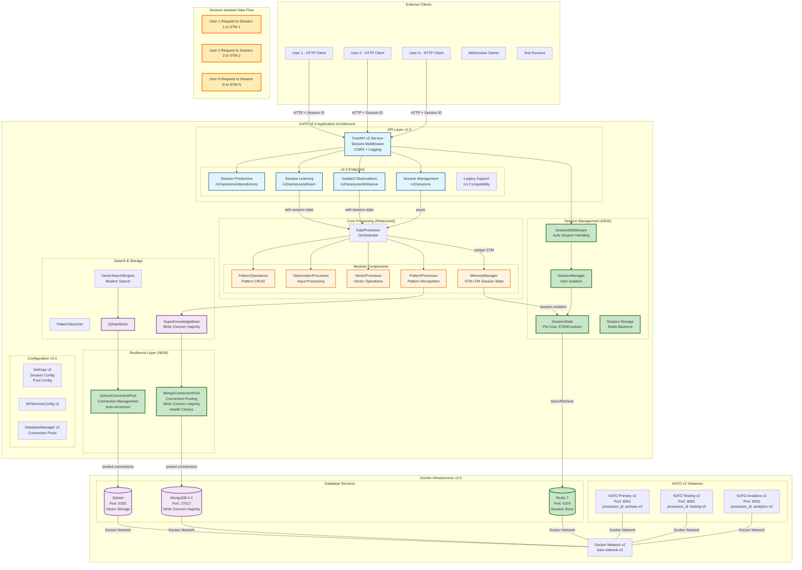

# KATO v2.0 System Architecture

## Major Architectural Changes from v1.0 to v2.0

### Key Improvements:
1. **Multi-User Session Isolation**: Complete STM isolation per user session
2. **Redis Integration**: Session state management with TTL support
3. **Connection Pooling**: Production-grade database connection management
4. **Write Durability**: MongoDB write concern changed from w=0 to w=majority
5. **Modular Architecture**: Refactored processors with clear separation of concerns
6. **Session Middleware**: Automatic session handling in API layer

## Complete v2.0 Architecture Diagram



## Detailed Component Changes

### 1. New Session Management Layer
**Purpose**: Enable multiple users to maintain completely isolated STM sequences

- **SessionManager**: Central coordinator for all user sessions
  - Creates unique session IDs
  - Manages session lifecycle (TTL, expiration)
  - Enforces resource limits per session
  
- **SessionState**: Isolated state container per user
  - Separate STM for each session
  - Isolated emotives accumulator
  - Session-specific time counter
  - Metadata and access tracking
  
- **SessionMiddleware**: Automatic session handling
  - Extracts session ID from requests
  - Loads/saves session state
  - Handles session creation and expiration
  
- **Redis Integration**: Persistent session storage
  - Fast in-memory session retrieval
  - TTL-based automatic cleanup
  - Distributed session support

### 2. New Resilience Layer
**Purpose**: Production-grade reliability and performance

- **MongoConnectionPool**:
  - Connection pooling (10-50 connections)
  - **CRITICAL**: Write concern changed from w=0 to w=majority
  - Automatic reconnection on failure
  - Health checks every 5 seconds
  - Retry logic for reads and writes
  
- **QdrantConnectionPool**:
  - Managed connection pool
  - Automatic failover
  - Request timeout handling

### 3. Refactored Core Processing
**Purpose**: Better modularity and separation of concerns

- **KatoProcessor**: Now acts as pure orchestrator
  - Delegates all operations to specialized modules
  - Manages session state injection/extraction
  - v2.0 methods: `set_stm()`, `get_emotives_accumulator()`
  
- **MemoryManager**: Enhanced for session support
  - Manages both global and session-specific state
  - `emotives_accumulator` for session isolation
  - Clean separation of STM/LTM operations
  
- **ObservationProcessor**: Modularized observation handling
  - Processes strings, vectors, emotives
  - Handles auto-learning triggers
  - Session-aware processing
  
- **PatternOperations**: CRUD operations for patterns
  - `get_pattern()`, `delete_pattern()`, `update_pattern()`
  - Centralized pattern manipulation

### 4. v2.0 API Endpoints

#### Session Management Endpoints (NEW)
- `POST /v2/sessions` - Create new session
- `GET /v2/sessions/{id}` - Get session info
- `DELETE /v2/sessions/{id}` - Delete session
- `GET /v2/sessions` - List active sessions

#### Session-Scoped Operations (NEW)
- `POST /v2/sessions/{id}/observe` - Observe in session context
- `POST /v2/sessions/{id}/learn` - Learn from session STM
- `GET /v2/sessions/{id}/stm` - Get session's STM
- `GET /v2/sessions/{id}/predictions` - Get session predictions
- `POST /v2/sessions/{id}/clear-stm` - Clear session STM

#### Backward Compatibility
- All `/v1/*` endpoints maintained for legacy support
- Default session creation for v1 endpoints

### 5. Data Isolation Architecture

```
User 1 → Session A → STM[['hello'], ['world']] → Predictions A
User 2 → Session B → STM[['foo'], ['bar']]    → Predictions B
User 3 → Session C → STM[['test'], ['data']]   → Predictions C

All sessions share:
- Same MongoDB (different processor_id namespaces)
- Same Qdrant collections
- Same KATO instance

But maintain complete isolation through:
- Session-specific STM
- Session-specific emotives
- Session-specific time counters
```

### 6. Configuration Changes

#### New Environment Variables
- `ENABLE_V2_FEATURES=true` - Enable v2.0 features
- `SESSION_TTL=3600` - Default session TTL in seconds
- `REDIS_URL=redis://localhost:6379` - Redis connection
- `MONGO_POOL_SIZE=50` - Connection pool size
- `HEALTH_CHECK_INTERVAL=5` - Health check frequency

#### Database Configuration
- MongoDB write concern: `w=majority, j=true` (was `w=0`)
- Connection pooling: 10-50 connections (was single)
- Retry logic: Enabled for reads and writes
- Compression: snappy, zlib enabled

### 7. Docker Infrastructure v2.0

#### New Services
- **Redis**: Session state storage
- Health checks on all services
- Restart policies: unless-stopped

#### Updated Images
- `Dockerfile.v2`: Includes v2.0 dependencies
- Additional packages: aioredis, connection pool libraries
- Health check endpoints: `/v2/health`

### 8. Testing Infrastructure v2.0

#### Session-Aware Testing
- Each test creates isolated session
- No cross-test contamination
- Parallel test execution with session isolation

#### New Test Categories
- `tests/v2/test_session_management.py`
- `tests/v2/test_multi_user_scenarios.py`
- `tests/v2/test_database_reliability.py`

## Migration Path from v1 to v2

1. **Database Migration**:
   - No schema changes required
   - Update write concern in existing deployments
   - Add connection pooling gradually

2. **API Migration**:
   - v1 endpoints remain functional
   - Gradually migrate to v2 session-based endpoints
   - Use session IDs for user isolation

3. **Infrastructure Migration**:
   - Add Redis for session storage
   - Update Docker images to v2
   - Configure connection pools

## Performance Improvements

1. **Connection Pooling**: 10-50x reduction in connection overhead
2. **Session Caching**: Sub-millisecond session retrieval from Redis
3. **Write Durability**: No data loss with w=majority
4. **Parallel Processing**: Multiple users truly concurrent
5. **Resource Limits**: Prevent memory exhaustion per session

## Security Enhancements

1. **Session Isolation**: Complete data isolation between users
2. **TTL Enforcement**: Automatic session expiration
3. **Resource Limits**: Per-session STM size limits
4. **Write Confirmation**: Guaranteed data persistence
5. **Health Monitoring**: Automatic failure detection

This v2.0 architecture provides production-ready multi-user support with complete session isolation, ensuring that KATO can serve multiple users simultaneously without any data collision or performance degradation.